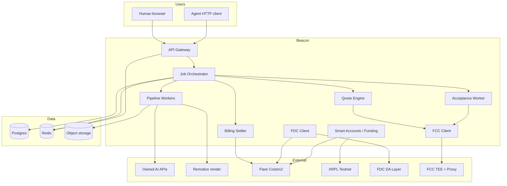
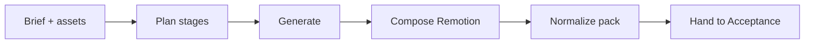
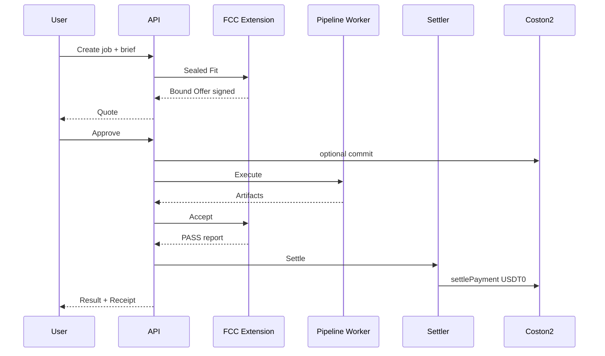
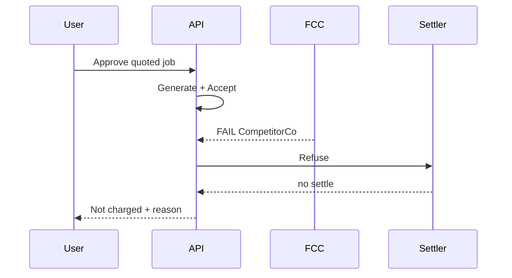

# Beacon — Complete Implementation Plan

**Status:** Execution plan (pre-code)  
**Network target (phase 1):** Flare Testnet Coston2 (chainId `114`) + XRPL Testnet  
**Product:** Beacon (see `PRODUCT.md`)  
**Honesty rule:** Facts from official Flare docs and verified Foundation repos only. Unknowns marked **UNKNOWN**. Decisions needing live checks marked **VALIDATE FIRST**. Do not invent Flare APIs.

**Frontend is last.** Build order is mandatory (§0).

---

# 0. Mandatory build order

| Phase | Work | Frontend? |
|---:|---|---|
| 0 | Research verification & go/no-go | No |
| 1 | Architecture freeze | No |
| 2 | Contracts | No |
| 3 | FCC extension | No |
| 4 | Backend core | No |
| 5 | Acceptance Engine | No |
| 6 | Quote / Sealed Fit engine | No |
| 7 | AI pipeline (gen + Remotion compose) | No |
| 8 | Billing / x402 settlement | No |
| 9 | Public APIs (REST + streaming) | No |
| 10 | Testing (unit → integration → e2e CLI) | No |
| 11 | Deployment (Coston2) | No |
| 12 | Documentation + honesty surfaces (`/health`) | No |
| 13 | Frontend (consumer app) | **Yes — last** |

Definition of done for moving past a phase: that phase’s DoD checklist in §32 is green, or explicitly waived with written risk.

---

# 1. Executive summary

Beacon is a first-party AI work platform: users choose a service, describe a job, approve a quote, receive finished media/docs, and are charged only when quality checks pass.

Engineering must deliver:

1. **Consumer API + later UI** that never expose protocol jargon.  
2. **Job state machine** from quote → execute → accept → settle/refuse.  
3. **FCC Flare Compute Extension** for private brief handling, Sealed Fit, private keys, acceptance signing.  
4. **USDT0 EIP-3009 payment** following Flare’s x402 guide pattern, extended for outcome pricing (**VALIDATE FIRST** hold design).  
5. **XRPL funding path** via Smart Accounts + FAssets FXRP → work credit.  
6. **FDC** for funding Payment proofs and optional Layer-4 external facts.  
7. **Owned AI pipelines** including Remotion composition for video.  
8. Honest **Coston2** deployment with `/health` / `/ready` telling the truth about TEE mode.

This document is the architecture authority for a senior team. Product UX authority is `PRODUCT.md`.

---

# 2. Product vision (engineering translation)

| Product promise | Engineering obligation |
|---|---|
| Instant quote | Quote engine &lt; ~3s p95 for beachhead templates; cache cost tables |
| Approve once | Single authorization artifact bound to `offer_id` |
| Live progress | Job events via SSE/WebSocket from orchestrator |
| Automatic payment | Settler settles EIP-3009 **only** on PASS (or user accept) |
| Beautiful receipt | Receipt record + PDF render; explorer links secondary |
| Invisible protocol | Copy dictionary enforced in API error messages and UI |

---

# 3. Technical vision

```
Client  →  API Gateway  →  Orchestrator  →  Workers
                              │
                              ├─ Quote / Sealed Fit (FCC + cost DB)
                              ├─ Pipeline workers (AI + Remotion)
                              ├─ Acceptance worker (FCC)
                              └─ Settler (x402 facilitator / escrow)
                              │
                         Postgres + Redis + Object storage
                              │
                    Flare Coston2 + XRPL Testnet + FDC DA layer
```

**Non-goals (v1):** third-party seller marketplace, mainnet production FCC claim without hardware path, inventing non-existent Flare opcodes.

---

# 4. Research verification (Phase 0) — do this first

## 4.1 Official sources to re-read before coding

| Topic | Source | Status |
|---|---|---|
| DevHub home / networks | https://dev.flare.network/ | Coston2 RPC, chainId 114, faucet |
| Developer tools | https://dev.flare.network/network/developer-tools | Bridges, OFTs (USDT0), RPCs, wallet SDKs |
| FCC overview | https://dev.flare.network/fcc/overview | FCE, TEE machine + proxy, not fully public production |
| Extension scaffold | https://github.com/flare-foundation/fce-extension-scaffold | OPType/OPCommand, InstructionSender, pre/post-build |
| Sign extension | https://github.com/flare-foundation/fce-sign | Key UPDATE/SIGN pattern; LANGUAGE=go\|python\|typescript |
| Weather + x402 | https://github.com/flare-foundation/fce-weather-insurance-x402-agent | TEE secrets, SIMULATED_TEE, x402 gateway routes, indexer DB |
| x402 payments | https://dev.flare.network/fxrp/token-interactions/x402-payments | MockUSDT0, Facilitator, EIP-3009, agent/server |
| Smart Accounts | https://dev.flare.network/smart-accounts/overview | Payment ref / memo flows, FDC Payment, PersonalAccount |
| Custom instructions | https://dev.flare.network/smart-accounts/custom-instruction | 0xFE / 0xFF |
| FAssets | https://dev.flare.network/fassets/* | Collateral, mint, redeem |
| FDC Web2Json / Payment | https://dev.flare.network/fdc/* | Attestation lifecycle, whitelist constraints |
| Foundation org | https://github.com/flare-foundation | tee-node, tee-proxy, fce-* examples |

## 4.2 VALIDATE FIRST checklist (blockers)

| ID | Question | How to validate | Blocks |
|---|---|---|---|
| V1 | Does faucet / live Coston2 USDT0 support EIP-3009? | Call token ABI / compare to MockUSDT0 in Hardhat starter x402 scripts | Billing |
| V2 | Outcome pricing: escrow contract vs delayed `settlePayment`? | Spike both against Facilitator semantics | Billing |
| V3 | Indexer DB creds for ext-proxy on Coston2 | Obtain from Flare TEE contact (Weather README requirement) | FCC round-trip |
| V4 | `SIMULATED_TEE` + `MODE=1` acceptable for hackathon demo honesty? | Align with official scaffolds; expose in `/health` | Judging |
| V5 | Remotion render in worker (CPU/GPU, timeouts) | Spike 15s captioned pack | Video pipeline |
| V6 | FXRP → USDT0 swap route on Coston2 | Uniswap V3 / docs swap guides | Funding |
| V7 | Web2Json hosts needed for Layer-4 demos | Whitelist / PublicWeb2 on testnet | Acceptance L4 |
| V8 | Smart Accounts operator + Core Vault addresses on Coston2 | Registry + docs / live `/ready` pattern | Funding |
| V9 | TEE sync response timeout (Weather notes ~2s sync limit) | Design async handlers for long AI/accept | FCC handlers |
| V10 | Provider API rate limits / cost | Account with each provider | Quote accuracy |

## 4.3 Known facts (do not re-litigate)

- FCC instructions relay after ≥50% data-provider signature weight ([FCC overview](https://dev.flare.network/fcc/overview)).  
- Extension = Docker code hash + registered TEE machines; results signed by TEE identity.  
- Scaffold OPType/OPCommand must match Solidity ↔ handler strings exactly.  
- Weather local path: Docker redis + ext-proxy + extension-tee; public tunnel for `EXT_PROXY_URL`; `SIMULATED_TEE=true`.  
- x402 Flare guide uses **MockUSDT0** + `X402Facilitator.verifyPayment` / `settlePayment`.  
- FXRP x402: docs state FXRP needs EIP-3009 before native x402 — settle in USDT0 for v1.  
- Smart Accounts: XRPL Payment → operator → FDC Payment proof → `MasterAccountController` → PersonalAccount.  

## 4.4 UNKNOWN

- Exact mainnet FCC GA date.  
- Exact production USDT0 OFT address behavior for EIP-3009 on Flare mainnet at ship time.  
- Whether devops-hosted Confidential Space VM will be available to the team during hackathon window.  
- Final κ of LLM judges before gold sets exist.

---

# 5. Complete system architecture

## 5.1 Context diagram



## 5.2 Trust boundary

| Zone | Holds | Must not hold |
|---|---|---|
| Browser | Session, UX | Provider API keys, TEE keys, operator keys |
| API | Sessions, job metadata, signed auth blobs | Long-lived provider master keys (prefer FCC) |
| Workers | Transient assets, render cache | User wallet seeds |
| FCC TEE | Brief plaintext, brand rules, provider keys, accept decision | Public logging of brief text |
| Chain | Offer commitments, payment events, TEE result hashes | Full brief plaintext |

---

# 6. Infrastructure

| Component | Phase 1 choice | Notes |
|---|---|---|
| Compute API | Single region Node host (e.g. Render/Fly) | Match team ops familiarity |
| Postgres | Managed Postgres | Jobs, users, receipts, costs |
| Redis | Managed Redis | Queues, locks, SSE fanout, rate limits |
| Object storage | S3-compatible | Inputs/outputs |
| FCC | Docker local/sim + optional devops VM | Per Foundation scaffolds |
| Chain RPC | `https://coston2-api.flare.network/ext/C/rpc` | Plus fallbacks from Developer Tools if needed |
| XRPL | Testnet WSS | Funding path |
| CI | GitHub Actions | lint, unit, forge, docker build |

**VALIDATE FIRST:** exact hosting vendors; not load-bearing to architecture.

---

# 7. Repository structure (monorepo)

Create new root `beacon/` (this folder). Never reuse another product’s tree.

```
beacon/
├── PRODUCT.md
├── IMPLEMENTATION.md          # this file
├── README.md
├── package.json               # npm workspaces
├── pnpm-workspace.yaml        # OR npm workspaces — pick one in Phase 1
├── turbo.json                 # optional
├── .env.example               # names only; no secrets
├── docker-compose.yml         # redis, postgres, local deps
├── apps/
│   ├── api/                   # HTTP API (Phase 4+)
│   └── web/                   # Consumer UI (Phase 13 LAST)
├── packages/
│   ├── shared/                # env, errors, ids, copy dictionary
│   ├── contracts/             # Foundry
│   ├── fdc/                   # attestation helpers
│   ├── smart-accounts/        # memo/ref encoding, UserOp helpers
│   ├── x402/                  # EIP-3009 + facilitator client
│   ├── quote/                 # cost models, offer hashing
│   ├── acceptance/            # L1–L5 orchestration (calls FCC)
│   ├── pipeline/              # job stage defs, Remotion triggers
│   └── receipts/              # receipt schema + PDF
├── services/
│   ├── orchestrator/          # state machine driver
│   ├── worker-pipeline/       # AI + compose
│   ├── worker-accept/         # acceptance jobs
│   ├── settler/               # settle / refuse
│   └── funding/               # XRPL observe + mint finalize
├── fce-beacon/                # FCC extension (from scaffold fork pattern)
│   ├── contracts/InstructionSender.sol
│   ├── go|typescript/         # prefer Go for reproducibility (scaffold recommendation)
│   ├── scripts/
│   ├── tools/
│   └── docker-compose.yaml
├── db/migrations/
├── scripts/                   # e2e CLI, verify-env, deploy
├── docs/
│   ├── ARCHITECTURE.md
│   ├── API.md
│   ├── THREAT_MODEL.md
│   ├── RUNBOOK.md
│   └── HONESTY.md             # SIMULATED_TEE claims policy
└── tests/
    ├── unit/
    ├── integration/
    └── e2e/                   # CLI e2e before browser e2e
```

---

# 8. Monorepo layout rules

1. `packages/*` have no dependency on `apps/web`.  
2. `fce-beacon` may be Go-primary; Node packages talk to it via proxy HTTP + on-chain instructions.  
3. Shared error codes map to **user-safe messages** in `packages/shared/copy.ts`.  
4. Contract ABIs generated into `packages/contracts/abi` and imported by API — no hand-copied addresses in UI without `/ready`.  

---

# 9. Frontend architecture (Phase 13 only — design now, build last)

**Deferred implementation**, but freeze UX contracts early:

| Route | Purpose |
|---|---|
| `/` | Marketing — brand + CTA |
| `/app` | Home inbox |
| `/app/new` | Choose service |
| `/app/jobs/:id` | Live progress + result |
| `/app/receipts/:id` | Receipt |
| `/app/credit` | Add work credit |

Stack suggestion (not mandatory): Vite or Next — **VALIDATE** based on Remotion preview needs and SSR. Prefer boring React + Vite if Remotion runs only in workers.

**Hard rules:**

- No protocol words in primary UI strings (enforce with i18n key lint).  
- Progress via SSE `GET /v1/jobs/:id/events`.  
- Wallet UI only on `/app/credit` and first Approve if signature required.

---

# 10. Backend architecture

## 10.1 API process

- HTTP framework: Fastify or Hono (**pick in Phase 1**; both fine).  
- Auth: session cookie (humans) + API keys (agents).  
- All mutations idempotent via `Idempotency-Key`.  

## 10.2 Orchestrator

- Consumes Redis streams / queues.  
- Owns job state transitions (see §19).  
- Writes event log for SSE.  

## 10.3 Workers

| Worker | Input | Output |
|---|---|---|
| pipeline | `job_id` + offer | artifacts in object storage |
| accept | artifacts + offer rubric | PASS/FAIL report |
| settler | PASS/FAIL | payment settle or release |
| funding | XRPL tx | credit ledger bump |

---

# 11. Gateway

API Gateway responsibilities:

1. TLS termination / platform ingress  
2. AuthN  
3. Rate limits (§23)  
4. Request validation (Zod/TypeBox)  
5. **Never** proxy provider keys to clients  
6. Map internal errors → user copy  

Optional: separate public Agent gateway subdomain with stricter quotas.

---

# 12. Worker architecture

- Horizontal workers; one job stage at a time.  
- Visibility timeout + heartbeat.  
- Poison queue after N fails.  
- Large artifacts never in Redis — only URLs + checksums.  

---

# 13. AI pipeline



### 13.1 Prompt pipeline

- Templates versioned (`prompt_version`).  
- Bound at quote time into offer metadata hash.  
- Logs store prompt **ids**, not full secret brand kits.

### 13.2 Asset pipeline

- Upload → virus/size checks → object storage → content-addressed keys.  
- Max sizes per service in config.

### 13.3 Remotion pipeline

- Worker runs Remotion render headlessly.  
- Input: composition props JSON + asset URLs.  
- Output: mp4/webm + captions.  
- **VALIDATE FIRST:** memory, timeout, concurrency.

### 13.4 OpenMontage-class orchestration

- Treat as **instruction/stage graph** pattern (plan → tools → checkpoints), not a hard dependency on a specific private repo API.  
- If using OpenMontage toolkit: pin version; document license.  
- If not: implement equivalent stage runner in `packages/pipeline`.  
- **UNKNOWN** until spike chooses vendor vs internal.

---

# 14. Acceptance Engine

Implemented primarily inside FCC for decision integrity; API stores the signed report.

| Layer | Where | Notes |
|---|---|---|
| L1 Objective | Worker or FCC | Prefer deterministic code; can run outside TEE then re-verify checksums in TEE |
| L2 Judge | FCC | Different model family; binary dimensions |
| L3 Brand | FCC | Private rules |
| L4 External | FDC + FCC | Only if offer requires |
| L5 Look | API | User Accept/Reject |

**Settle gate** reads FCC-signed `AcceptReport`.

κ calibration: offline eval harness in `packages/acceptance` — not user-facing.

---

# 15. Sealed Fit

Runs **before** execution.

Inputs: brief, service_id, asset manifests, optional brand pack id.  
Process (inside FCC when possible):

1. Hash brief → `brief_hash`  
2. Select rubric template for service  
3. Capability matrix: capacity, supported formats, SLA feasibility  
4. Private route selection (model mix) — not returned to client  
5. Price = cost model + margin  
6. Sign Bound Offer  

If NO FIT → API returns user message: “We can’t take this job as described” + suggested edits. No charge path.

**Async note:** Weather docs warn short sync TEE timeouts — Sealed Fit must be **async action** if it calls models.

---

# 16. Bound Offer

Canonical fields (internal; client sees quote DTO only):

```
offer_id: uuid
job_id: uuid
service_id: string
brief_hash: bytes32
rubric_version: string
rubric_hash: bytes32
price_usdt0: uint256   # 6 decimals
currency: "USDT0"
sla_seconds: uint32
max_retries: uint8
expires_at: timestamptz
capability: FIT | NO_FIT
route_commitment: bytes  # encrypted/private
tee_signature: bytes
code_hash: bytes32       # extension image
created_at
```

Client quote DTO:

```
quote_id, price_display, eta_seconds, includes[], expires_at
```

Approve binds user authorization to `offer_id`.

---

# 17. Storage

| Store | Data |
|---|---|
| Postgres | users, sessions, jobs, offers, events, ledger, receipts |
| Redis | queues, locks, rate limits, SSE pubsub |
| Object storage | uploads, outputs, evidence blobs |
| Chain | commitments, payments, TEE results |

Retention: briefs deleted or re-encrypted per policy after N days — **DEFINE** in security review.

---

# 18. Caching

- Cost tables (TTL minutes)  
- Rubric definitions (versioned, immutable)  
- Registry contract addresses (boot + periodic refresh)  
- Remotion preview thumbs (optional)

Do not cache acceptance decisions across jobs.

---

# 19. Queues & job state machine

## 19.1 States

```
DRAFT
→ QUOTING
→ QUOTED
→ AUTHORIZED
→ PREPARING
→ GENERATING
→ COMPOSING
→ ACCEPTING
→ NEEDS_LOOK | PASSED | FAILED
→ SETTLING | REFUSING
→ CLOSED
→ EXPIRED (from QUOTED)
→ CANCELED
```

## 19.2 Transitions (authoritative)

| From | To | Trigger |
|---|---|---|
| DRAFT | QUOTING | create job |
| QUOTING | QUOTED | Sealed Fit FIT |
| QUOTING | FAILED | NO_FIT / error |
| QUOTED | AUTHORIZED | user approve + valid auth |
| QUOTED | EXPIRED | clock |
| AUTHORIZED | PREPARING | orchestrator |
| PREPARING | GENERATING | stages start |
| GENERATING | COMPOSING | gen done (if needed) |
| COMPOSING | ACCEPTING | artifacts ready |
| ACCEPTING | PASSED/FAILED/NEEDS_LOOK | AcceptReport |
| NEEDS_LOOK | PASSED/FAILED | user |
| PASSED | SETTLING | settler |
| FAILED | REFUSING | settler |
| SETTLING/REFUSING | CLOSED | terminal |

Illegal transitions must throw and alert.

---

# 20. Streaming

- **SSE** preferred for browser progress (`text/event-stream`).  
- WebSocket optional for agents.  
- Events: `stage`, `progress`, `artifact`, `status`, `error` (user-safe).  

---

# 21. Database schema (v1)

## 21.1 Tables (logical)

**users**  
`id, created_at, display_name, primary_auth`

**auth_identities**  
`user_id, kind (xrpl|evm|email), subject, meta`

**credits_ledger**  
`id, user_id, amount_usdt0, reason, ref_type, ref_id, created_at`

**jobs**  
`id, user_id, service_id, status, brief_uri, brand_pack_id, created_at, updated_at`

**offers**  
`id, job_id, price_usdt0, expires_at, brief_hash, rubric_hash, tee_sig, raw_offer_json, status`

**authorizations**  
`id, offer_id, user_id, eip3009_payload, valid_before, status`

**artifacts**  
`id, job_id, kind, uri, sha256, meta`

**accept_reports**  
`id, job_id, offer_id, result, report_json, tee_sig, confidence`

**receipts**  
`id, job_id, payment_id, tx_hash, offer_id, accept_id, pdf_uri`

**job_events**  
`id, job_id, ts, type, payload`

**cost_events**  
`id, job_id, provider, units, usd_estimate, raw`

## 21.2 Indexes

- `jobs(user_id, created_at desc)`  
- `jobs(status)`  
- `offers(job_id)`  
- `job_events(job_id, ts)`  
- `credits_ledger(user_id, created_at)`  
- Unique: `authorizations(offer_id)` where status=active  

---

# 22. Redis

| Key pattern | Use |
|---|---|
| `q:pipeline` | list/stream |
| `q:accept` | list/stream |
| `q:settle` | list/stream |
| `lock:job:{id}` | mutex |
| `sse:job:{id}` | pubsub |
| `rl:user:{id}` | rate limit |
| `idem:{key}` | idempotency |

---

# 23. Authentication & authorization

| Actor | Auth | AuthZ |
|---|---|---|
| Human | Session after wallet/email link | own jobs |
| Agent | API key (hashed at rest) | scoped services + spend ceiling |
| Admin | SSO / break-glass | ops only |
| Settler wallet | server key | chain settle only |

Spend ceiling for agents: application-level in API (**not** claiming AgentVault compatibility).

---

# 24. Wallet architecture (user-facing)

| Path | User action | Behind the scenes |
|---|---|---|
| Add credit (XRP) | Confirm in Xaman/XRPL wallet | Smart Accounts + FAssets mint + credit ledger |
| Add credit (EVM) | Confirm USDT0 transfer/auth | Ledger bump |
| Approve job | One signature if required | Bind EIP-3009 auth to offer |

UI copy: “Add credit” / “Approve” only.

---

# 25. XRPL flow

1. API prepares payment instructions (amount, destination, memo/ref).  
2. User pays on XRPL Testnet.  
3. Funding service observes tx.  
4. FDC Payment attestation prepared/submitted/retrieved per FDC guides.  
5. Operator/executor path submits to MasterAccountController as documented.  
6. Credit ledger increases when PersonalAccount/FXRP path confirmed.

**VALIDATE FIRST:** exact memo opcode (direct mint `0xFE`/`0xFF` vs payment reference) for “deposit to Beacon credit” custom instruction — register custom instruction with MAC before use ([custom instruction docs](https://dev.flare.network/smart-accounts/custom-instruction)).

---

# 26. Smart Accounts flow

Follow official workflow:

```
XRPL Payment → operator → FDC Payment proof → MasterAccountController
  → PersonalAccount action (transfer FXRP / custom instruction)
```

Beacon custom instruction goals (v1):

- Transfer FXRP to treasury/credit manager contract **or**  
- Call `BeaconCredit.depositFromPersonalAccount`  

**VALIDATE FIRST:** which pattern is simpler with existing encoder libs (`@flarenetwork/smart-accounts-encoder`).

---

# 27. FXRP flow

1. Mint via FAssets (Core Vault / agent paths as docs).  
2. FXRP arrives on PersonalAccount / designated address.  
3. Swap FXRP→USDT0 if needed ([FXRP token interaction docs](https://dev.flare.network/fxrp/overview)).  
4. USDT0 credited to internal ledger and/or custodial hot wallet for settlement inventory.

Risk: swap slippage — show user final credit estimate before confirm.

---

# 28. USDT0 flow

- Settlement asset for jobs: USDT0 (6 decimals in MockUSDT0 demos).  
- Developer Tools lists USD₮0 as OFT on Flare.  
- **V1 testnet:** likely MockUSDT0 if faucet token lacks EIP-3009 (**V1 VALIDATE**).  
- Treasury holds inventory to receive settles.  

---

# 29. x402 settlement

### 29.1 Standard pattern (docs)

1. Client requests protected resource.  
2. `402` + payment requirements.  
3. Client signs EIP-3009 `transferWithAuthorization`.  
4. Server `verifyPayment` → `settlePayment` on Facilitator.  
5. Resource returned + `X-Payment-Response`.

Reference: [x402 Payment Protocol](https://dev.flare.network/fxrp/token-interactions/x402-payments), Weather agent x402 routes.

### 29.2 Beacon outcome pricing (design — VALIDATE FIRST)

Standard pattern settles **before** delivering the resource. Beacon must not charge for FAILED work.

Options:

| Option | Idea | Pros | Cons |
|---|---|---|---|
| A | Escrow contract: lock on Approve; release on AcceptReport | Clear | Extra contract; not in official x402 demo |
| B | Sign auth on Approve with long `validBefore`; call `settlePayment` only on PASS | Closer to x402 | Auth expiry; must prevent early settle |
| C | Charge small “prep fee” always + outcome fee on PASS | Simpler cashflow | Weakens “free on fail” story |

**Phase 0 spike picks A or B.** Document choice in `docs/BILLING.md`. Do not claim escrow is “official x402” — it is Beacon application logic composing EIP-3009.

### 29.3 Agent API

Agents may use classic 402 handshake on `POST /v1/agent/jobs` **after** quote, with settlement gated the same as humans.

---

# 30. FCC extension (`fce-beacon`)

## 30.1 Base

Fork pattern from [fce-extension-scaffold](https://github.com/flare-foundation/fce-extension-scaffold) / specialize like Weather & Sign.

Prefer **Go** for bit-for-bit reproducible images (scaffold + sign READMEs).

## 30.2 OPType / OPCommand (proposed — implement exactly in Solidity + handler)

| OPType | OPCommand | Purpose |
|---|---|---|
| `FIT` | `EVALUATE` | Sealed Fit → Bound Offer bytes |
| `JOB` | `ACCEPT` | Acceptance Engine report |
| `KEY` | `UPSERT` | Provider key install (sign-extension analog; off-chain secret delivery preferred — see fce-sign warning) |
| `JOB` | `ROUTE` | optional private route commit |

**Do not invent wire protocols** beyond scaffold’s action/result model.

## 30.3 InstructionSender.sol

- `requestFit(bytes payload)`  
- `requestAccept(bytes payload)`  
- Emits instructions via Flare TEE Manager diamond pattern (copy from scaffold/Weather).  
- Stores latest result commitments for jobs.  

## 30.4 TEE flow

```
API/worker → on-chain instruction OR direct proxy path (as allowed by scaffold)
  → data providers / proxy
  → TEE handler
  → signed result
  → API polls proxy /info + action result (Weather frontend pattern)
```

Long AI calls: **async** handlers (Weather troubleshooting: sync 2s limit).

## 30.5 Local / simulated

Follow Weather:

- `SIMULATED_TEE=true`, compose `MODE=1`  
- Tunnel `EXT_PROXY_URL`  
- Indexer DB toml from Flare contact  
- `/health` must say confidentiality demonstrated, not hardware-enforced  

## 30.6 Production path

- `SIMULATED_TEE=false`, `MODE=0`  
- Devops Confidential Space VM  
- Reproducible build + register code hash  

---

# 31. FDC integration

| Use | Attestation | Docs |
|---|---|---|
| XRPL funding proof | Payment / XRPPayment | FDC payment guides |
| Address checks | AddressValidity | as needed |
| External JSON facts | Web2Json | whitelist constraints |
| On-Flare events | EVMTransaction | as needed |

Flow: prepare → requestAttestation → wait voting round → DA layer proof → verify on-chain.

Handle Web2Json consensus failures (non-deterministic APIs) per [troubleshooting](https://dev.flare.network/fdc/troubleshooting).

---

# 32. Contracts (application)

## 32.1 List

| Contract | Role |
|---|---|
| `BeaconInstructionSender` | FCC instructions (scaffold-based) |
| `BeaconJobRegistry` | job/offer commitments, status bits |
| `BeaconEscrow` or billing adapter | **if Option A** |
| `BeaconCredit` | optional on-chain credit mirror |
| `MockUSDT0` | testnet if needed |
| `X402Facilitator` | from Flare starter / deploy scripts |

## 32.2 Events (illustrative)

- `OfferCommitted(bytes32 offerId, bytes32 briefHash, uint256 price)`  
- `JobAuthorized(bytes32 jobId, bytes32 offerId)`  
- `JobClosed(bytes32 jobId, uint8 result, bytes32 paymentId)`  

## 32.3 Interfaces

Freeze Solidity interfaces in Phase 2 before backend types. Generate TS ABIs.

## 32.4 Storage

Prefer minimal on-chain storage; heavy data off-chain with hashes on-chain.

---

# 33. API design

## 33.1 REST (v1)

| Method | Path | Purpose |
|---|---|---|
| GET | `/health` | liveness + honesty fields |
| GET | `/ready` | deps + registry addresses |
| POST | `/v1/jobs` | create draft |
| POST | `/v1/jobs/:id/quote` | run Sealed Fit |
| POST | `/v1/jobs/:id/approve` | bind authorization |
| GET | `/v1/jobs/:id` | status |
| GET | `/v1/jobs/:id/events` | SSE |
| GET | `/v1/jobs/:id/artifacts` | results |
| POST | `/v1/jobs/:id/look` | accept/reject |
| GET | `/v1/receipts/:id` | receipt JSON |
| POST | `/v1/credit/prepare` | XRPL/EVM funding prep |
| POST | `/v1/credit/finalize` | after payment |
| GET | `/v1/services` | catalog |

Agent: same under `/v1/agent/*` with API key + 402 where applicable.

## 33.2 Error shape

```
{ "error": { "code": "NO_FIT", "message": "We can’t take this job as described." } }
```

`message` always user-safe.

---

# 34. Retry logic

| Layer | Policy |
|---|---|
| Provider 429/5xx | exp backoff, jitter, max 3 |
| FDC round miss | re-request once |
| TEE proxy timeout | retry poll; don’t double-charge |
| Settle revert | alert + manual runbook |
| Remotion fail | one retry; then FAIL job free |

Idempotency keys on settle.

---

# 35. Rate limits

- Per user: N jobs/hour  
- Per API key: N req/min  
- Upload bandwidth caps  
- Expensive services stricter  

---

# 36. Cost accounting & billing

- Every provider call → `cost_events`  
- Quote = estimated fully loaded cost × margin  
- After job: variance report internal only  
- Target margin 15–35% (product goal; not a chain param)

---

# 37. Quote engine

1. Load service cost model  
2. Estimate tokens/seconds/render minutes  
3. FCC Sealed Fit confirms FIT  
4. Persist offer  
5. Return quote DTO  

Timeout budget: hard fail quote after T seconds → user retries.

---

# 38. Receipts & evidence

Receipt JSON:

- job summary  
- price  
- timestamps  
- artifact checksums  
- accept result summary  
- payment id / tx hash  
- offer_id / brief_hash / rubric_hash  

PDF rendered server-side for “beautiful receipt.”

Evidence blobs (judge): tee sigs, optional explorer links — behind “Verification details.”

---

# 39. Error handling & recovery

| Failure | Recovery |
|---|---|
| Quote timeout | QUOTING→FAILED user-safe |
| Gen fail | retry then FAIL free |
| Accept TEE down | pause job; no settle |
| Settle fail after PASS | retry settler; credit adjustment runbook |
| Stuck XRPL mint | Smart Accounts recovery opcodes `0xE0`/`0xE1` per docs |
| Tunnel URL change | re-register TEE (Weather note) |

---

# 40. Security

## 40.1 Threat model (summary)

| ID | Threat | Mitigation |
|---|---|---|
| T1 | Provider key theft | Prefer keys in FCC; rotate |
| T2 | Brief leakage | TEE + encrypted at rest; no clear logs |
| T3 | False PASS to collect | Attested accept + code hash; audits |
| T4 | Early settle | Settler only on PASS; auth binding |
| T5 | Replay payments | EIP-3009 nonces |
| T6 | Prompt injection → unexpected spend | App spend ceilings; no raw tool wallet |
| T7 | Overclaim hardware TEE | `/health` honesty |
| T8 | Malicious uploads | type/size scanners |

Full write-up: `docs/THREAT_MODEL.md` in Phase 12.

## 40.2 Secrets

- Never commit `.env`  
- Platform secret manager  
- Separate deployer / settler / proxy keys  
- `.env.example` names only  

---

# 41. Monitoring, metrics, logging

### Metrics

- jobs_created, quote_latency_ms, fit_ratio  
- pipeline_duration_ms, accept_pass_rate  
- settle_success, settle_fail  
- credit_volume_usdt0  

### Logs

- Structured JSON  
- Redact briefs, keys, auth payloads  
- Correlate `job_id`  

### Alerts

- settle fail  
- TEE unhealthy  
- queue depth  
- error budget burn  

---

# 42. CI/CD

```
PR → lint → typecheck → unit → forge test → docker build fce-beacon
main → deploy API staging → smoke /health /ready
tag → Coston2 scripted deploy notes
```

Frontend deploy last.

---

# 43. Testing strategy

| Layer | Tool | When |
|---|---|---|
| Unit | vitest / go test | Phase 4+ |
| Contracts | forge | Phase 2+ |
| Conformance | scaffold test-conformance | Phase 3 |
| Integration | testcontainers redis/pg | Phase 4+ |
| Live FDC | optional gated vitest | with secrets |
| E2E CLI | tsx scripts | before UI |
| Browser e2e | Playwright | Phase 13 |
| Gold set accept | offline harness | Phase 5 |

**Do not** ship with empty critical e2e for billing path.

---

# 44. Local development

1. `docker compose up` postgres redis  
2. Foundry + Node 20+  
3. `fce-beacon` local simulated path  
4. `.env` from `.env.example`  
5. `scripts/verify-env.ts` must pass  

Dev containers: optional `devcontainer.json` — nice-to-have.

---

# 45. Environment variables (names only)

### App

`NODE_ENV`, `APP_URL`, `API_URL`, `API_PORT`, `LOG_LEVEL`, `SESSION_SECRET`, `CHAIN_ID=114`

### Chain

`COSTON2_RPC_URL`, `COSTON2_WSS_URL`, `FLARE_CONTRACT_REGISTRY`, expected address asserts for AssetManager, MAC, FdcHub, FdcVerification, FxrpToken, Core Vault XRPL

### Keys (never commit)

`DEPLOYMENT_PRIVATE_KEY`, `SETTLER_PRIVATE_KEY`, `PROXY_PRIVATE_KEY`

### FCC

`SIMULATED_TEE`, `MODE`, `EXT_PROXY_URL`, `NORMAL_PROXY_URL`, `EXTENSION_ID`, `INSTRUCTION_SENDER`, `LANGUAGE`, `GOVERNANCE_SIGNERS`, `GOVERNANCE_THRESHOLD`

### FDC

`FDC_VERIFIER_XRP_URL`, `FDC_VERIFIER_EVM_URL`, `FDC_API_KEY`, `DA_LAYER_URL`

### XRPL

`XRPL_WSS_URL`, `XRPL_NETWORK`

### x402

`X402_TOKEN_ADDRESS`, `X402_FACILITATOR_ADDRESS`, `X402_PAYEE_ADDRESS`

### AI

`ANTHROPIC_API_KEY`, `OPENAI_API_KEY`, image/video/voice keys as needed — prefer injection into TEE

### Storage

`DATABASE_URL`, `REDIS_URL`, `S3_*`

---

# 46. Docker

- `docker-compose.yml`: postgres, redis  
- `fce-beacon/docker-compose.yaml`: redis, ext-proxy, extension-tee (scaffold style)  
- API Dockerfile for deploy  
- Remotion worker may need Chromium deps — document in RUNBOOK  

---

# 47. Deployment

## 47.1 Coston2 first

1. Deploy contracts  
2. Register FCC extension + TEE  
3. Deploy MockUSDT0/Facilitator if required  
4. Deploy API  
5. Run CLI e2e: quote→approve→fake-pipeline→accept→settle  
6. Only then web  

Faucet: https://faucet.flare.network/coston2 (C2FLR, FXRP, USDT0 per DevHub).

## 47.2 Mainnet later

- Real USDT0 EIP-3009 **VALIDATE**  
- Real FCC hardware  
- Songbird canary if required by Flare ops  
- Security audit  
- Kill simulated flags  

---

# 48. Production checklist

- [ ] `/health` honesty matches TEE mode  
- [ ] `/ready` registry asserts  
- [ ] No secrets in repo  
- [ ] Settle only on PASS tested  
- [ ] Free on FAIL tested  
- [ ] Rate limits on  
- [ ] Backups for Postgres  
- [ ] Runbook for stuck jobs  
- [ ] Receipt PDF works  
- [ ] Copy lint passes (no protocol leaks)

---

# 49. Kill tests (engineering)

| ID | Test | Kill if |
|---|---|---|
| K1 | CLI e2e PASS settles | settle without accept report |
| K2 | CLI e2e FAIL no settle | any charge |
| K3 | Quote NO_FIT | job still executable |
| K4 | Remove FCC accept sig check | still settles |
| K5 | `/health` claims hardware while SIMULATED | must fail CI |
| K6 | User copy grep for FCC|TEE|x402|FDC in UI strings | any hit in primary paths |

---

# 50. Risk analysis

| Risk | Severity | Mitigation |
|---|---|---|
| FCC not hardware-ready | High for claims | Honest health; still ship simulated per official path |
| Outcome billing design wrong | High | Phase 0 spike V2 |
| Remotion too slow/expensive | Med | Template limits; async |
| Judge quality poor | Med | Objective-first templates |
| Indexer DB access denied | High for FCC | Contact Flare early (V3) |
| Scope creep marketplace | High | First-party only v1 |

---

# 51. Milestones

| Milestone | Outcome |
|---|---|
| M0 | Research verification doc signed |
| M1 | Contracts + Facilitator on Coston2 |
| M2 | FCC Fit + Accept handlers green locally |
| M3 | Orchestrator state machine + fake pipeline |
| M4 | Real Remotion pack for one template |
| M5 | Billing settle/refuse correct |
| M6 | Funding XRPL→credit works |
| M7 | CLI e2e full loop |
| M8 | `/health` `/ready` + docs |
| M9 | Frontend magical path |
| M10 | External testers |

Hackathon deadline context: Summer Signal closes mid-August 2026 — compress M9 after M7.

---

# 52. Execution phases (detailed)

### Phase 0 — Research verification (2–4 days)

- Complete V1–V10 spikes  
- Write `docs/RESEARCH_LOG.md` with evidence links  
- Freeze billing option A/B  
- Freeze LANGUAGE=go for extension  

### Phase 1 — Architecture freeze (1–2 days)

- This document ratified  
- OpenAPI skeleton committed  
- State machine tests as tables  

### Phase 2 — Contracts (3–5 days)

- Foundry project  
- JobRegistry + InstructionSender  
- Escrow if A  
- Deploy scripts + forge tests  

### Phase 3 — FCC extension (5–8 days)

- Scaffold customization  
- FIT.EVALUATE + JOB.ACCEPT  
- Local simulated e2e  
- Honesty flags  

### Phase 4 — Backend core (5–7 days)

- API skeleton, env verify, postgres migrations  
- Orchestrator + Redis queues  
- Job CRUD  

### Phase 5 — Acceptance Engine (4–6 days)

- L1 libraries  
- L2 judge prompts + harness  
- Wire FCC ACCEPT  

### Phase 6 — Quote / Sealed Fit (3–4 days)

- Cost models  
- FIT path  
- Quote DTO  

### Phase 7 — AI pipeline (5–10 days)

- One video template end-to-end  
- Remotion worker  
- Image/voice stubs  

### Phase 8 — Billing (3–5 days)

- EIP-3009 approve bind  
- Settler PASS/FAIL  
- Ledger  

### Phase 9 — APIs (2–3 days)

- SSE  
- Agent routes  
- Credit prepare/finalize  

### Phase 10 — Testing (ongoing + 3 days hardening)

- Unit coverage gates  
- CLI e2e  
- Chaos: TEE down, settle revert  

### Phase 11 — Deployment (2–3 days)

- Coston2 addresses committed via `/ready`  
- Staging API  

### Phase 12 — Documentation (2 days)

- README, RUNBOOK, HONESTY, API.md  
- Judge packet  

### Phase 13 — Frontend LAST (5–8 days)

- Magical path only  
- Receipt beauty  
- Copy lint  
- Playwright smoke  

---

# 53. Daily tasks template (after kickoff)

Each day:

1. Update `docs/DAILY.md` — done / blockers / VALIDATE results  
2. Keep `/health` deployable even if degraded  
3. No frontend work until M7 unless spike prototypes behind flag  
4. Never commit secrets  

---

# 54. Definition of Done (global)

A feature is done when:

1. Tests exist and pass in CI  
2. Errors are user-safe  
3. Observability hooks exist  
4. RUNBOOK entry if ops-relevant  
5. No new UNKNOWN left undocumented  
6. PRODUCT.md UX rules not violated  

---

# 55. Mermaid — end-to-end happy path



---

# 56. Mermaid — fail path (no charge)



---

# 57. Open questions register

| ID | Question | Owner | Status |
|---|---|---|---|
| Q1 | Escrow vs delayed settle | Billing lead | VALIDATE FIRST |
| Q2 | Remotion in Docker memory | Pipeline lead | VALIDATE FIRST |
| Q3 | OpenMontage dependency vs internal stages | Pipeline lead | UNKNOWN |
| Q4 | Email auth vs wallet-only for beachhead | Product | UNKNOWN |
| Q5 | Devops TEE slot dates | FCC lead | UNKNOWN |

---

# 58. References (canonical)

1. https://dev.flare.network/  
2. https://dev.flare.network/network/developer-tools  
3. https://dev.flare.network/fcc/overview  
4. https://dev.flare.network/fxrp/token-interactions/x402-payments  
5. https://dev.flare.network/smart-accounts/overview  
6. https://dev.flare.network/smart-accounts/custom-instruction  
7. https://dev.flare.network/fdc/guides/hardhat/web2-json  
8. https://github.com/flare-foundation  
9. https://github.com/flare-foundation/fce-extension-scaffold  
10. https://github.com/flare-foundation/fce-sign  
11. https://github.com/flare-foundation/fce-weather-insurance-x402-agent  
12. https://faucet.flare.network/coston2  

---

# 59. Final engineering statement

Build the trust loop first (contracts → FCC → accept → settle), then the work loop (pipeline), then the money loop (funding), then the API polish, then — and only then — the consumer UI that makes the first 20 seconds magical.

If documentation is missing for a Flare surface, stop and mark **UNKNOWN** / **VALIDATE FIRST**. Do not invent protocol features.

---

*End of IMPLEMENTATION.md — living document; update Research Log as V1–V10 close.*
