# Beacon

Flare-native AI execution: agents act inside explicit financial boundaries, with hardware-backed confidential policy evaluation and explorer receipts.

**Finish AI work. Pay only when it passes.**

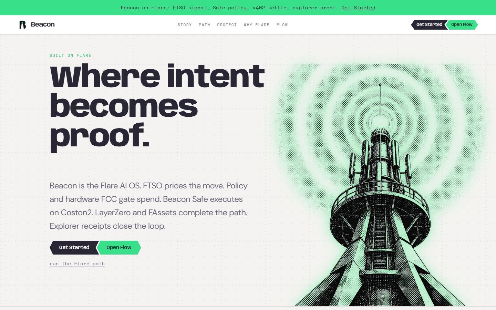

*Desk hero: intent, hardware FCC, Beacon Safe, explorer receipts.*

[Live desk](https://beacon-desk.vercel.app) · [API](https://beacon-api-97gl.onrender.com) · [Coston2 faucet](https://faucet.flare.network/coston2) · [FCC extension 65925](https://coston2-systems-explorer.flare.network/tee/extensions/65925)

Network: **Flare Testnet Coston2** (chain ID **114**). License: MIT.

---

## Why Beacon

AI agents need authority. Users should not hand them an unrestricted private key.

Beacon puts a prepaid budget in a **Beacon Safe**, evaluates spend against **policy + hardware FCC**, then executes on Flare rails and leaves a receipt you can open.

The agent never receives the user’s private key.

---

## How it works

```
USER INTENT  →  BEACON AGENT  →  SAFE + POLICY  →  FLARE DATA / FCC  →  EXECUTION  →  VERIFIABLE RECEIPT
```

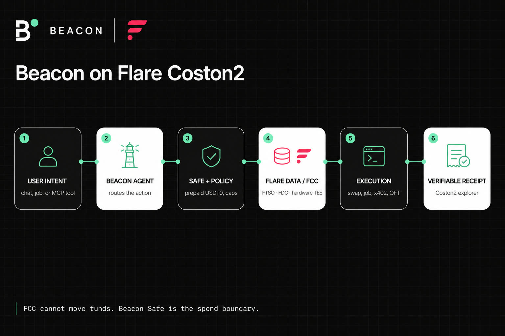

*FCC cannot move funds. Beacon Safe is the spend boundary.*

| Step | What happens |
|------|----------------|
| Intent | Chat, Agent Job, or MCP tool call |
| Agent | Routes swap, job, bridge, x402, FAssets, or research |
| Safe + policy | Prepaid Coston2 USDT0. Caps, session, pause |
| Flare / FCC | FTSO prices, FDC attestations, hardware TEE decision |
| Execution | SwapDesk, Jobs escrow, x402 pull, LayerZero OFT |
| Receipt | Coston2 explorer (and LayerZero Scan when bridging) |

---

## Core product

| Surface | Route | Role |
|---------|-------|------|
| **Flow** | `/flow` | Chat OS: swap, bridge, signals, FAssets, x402 |
| **Jobs** | `/flow/desk` | Paid generation with escrow, settle, or refund |
| **Safe** | `/flow/security` | Personal vault per wallet, fund once, set policy |
| **Agents** | `/flow/mcp` | Claude / Cursor / MCP clients. Capabilities, not keys |

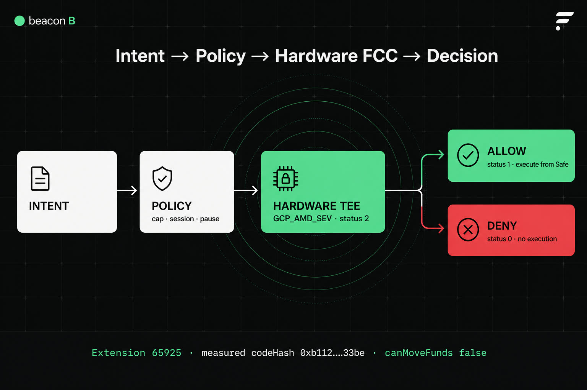

**Safe.** `BeaconSafeFactory` creates one `BeaconAgentVault` per wallet. Deposit official Coston2 USDT0. The owner sets caps. An allowlisted executor submits transactions; the contract enforces target/selector allowlists, per-tx and rolling caps, pause, expiry, and replay nonces.

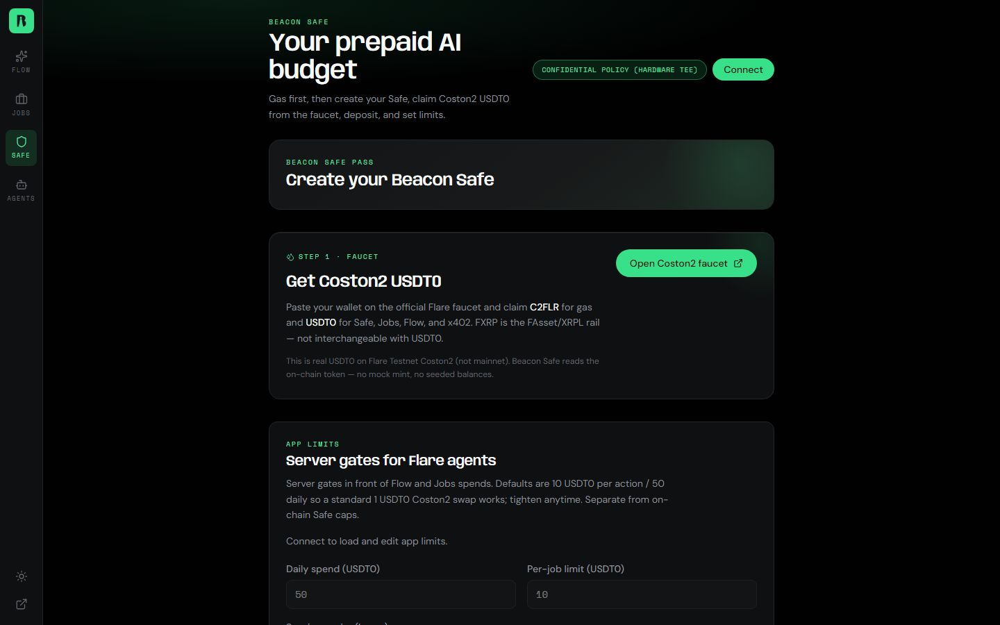

*Create Safe, faucet USDT0, then set app limits. On-chain vault caps stay separate.*

**Policy.** App limits plus on-chain vault caps. Fail-closed. Over-cap requests are denied before money moves.

**Flow.** The desk for Flare work. Coston2 Safe swaps go through **Beacon SwapDesk** with an FTSOv2 guard. SparkDEX SwapRouter bytecode is empty on Coston2; SparkDEX is not the Coston2 execute path.

**Jobs.** Quote → Safe lock (or wallet `lockFrom` fallback) → generate → accept → `release` or `refund`. Failed generation refunds the Safe. UI copy: “Generation failed. You were not charged.”

**x402.** HTTP 402 + Coston2 USDT0 ERC-20 approve / facilitator `transferFrom`. The faucet token has **no EIP-3009**.

**MCP.** Wallet-bound grants with scopes, caps, TTL, and revoke. `POST /mcp` never sees a private key. Live Claude/Cursor tool execution is a user-side check — this repo proves grants, scopes, and health, not a third-party agent session.

---

## Flare integration

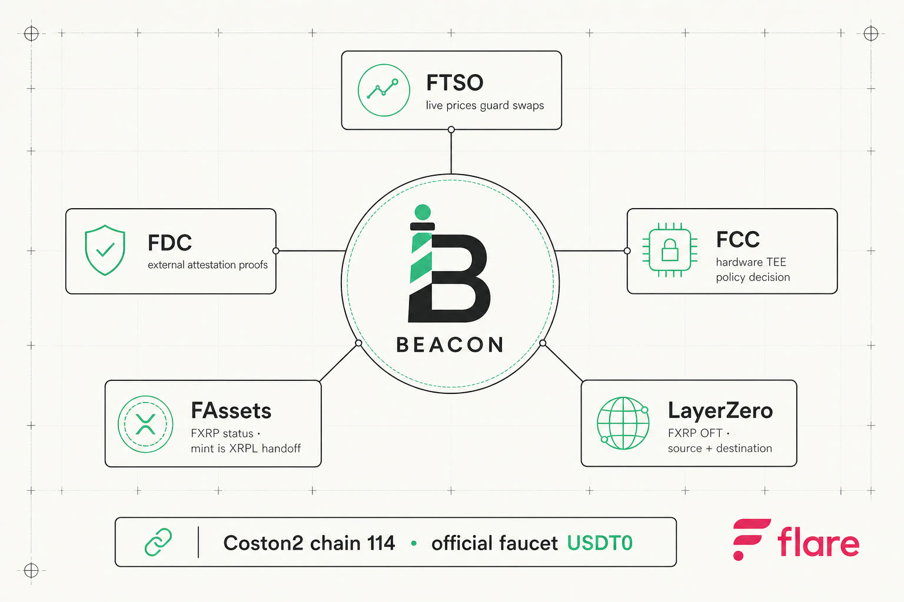

| Rail | Beacon use | Status | Proof |
|------|------------|--------|-------|
| **FTSO** | FTSOv2 prices guard Safe swaps | **REAL** | [Price feeds](https://coston2-systems-explorer.flare.network/price-feeds?tab=block-latency) · `GET /v1/ftso/guard` |
| **FDC** | AddressValidity prepare → submit → DA proof → on-chain verify. Never invents proofs | **REAL** | [Round 1423862](https://coston2-systems-explorer.flare.network/voting-round/1423862?tab=fdc) · [submit tx](https://coston2-explorer.flare.network/tx/0x8a4fedfbc4c7642b295befddf87b12b31fd0e4980358877e215591a9f3cb1d5e) |
| **FCC** | Hardware TEE signs ALLOW / DENY. Cannot move funds | **REAL** (Coston2 FCE) | [Extension 65925](https://coston2-systems-explorer.flare.network/tee/extensions/65925) |
| **FAssets** | FXRP status + redeem prepare. Mint is XRPL / Xaman | **PARTIAL** — mint **HANDOFF** | [FAssets explorer](https://coston2-systems-explorer.flare.network/fassets) |
| **LayerZero** | FXRP OFT Coston2 → Sepolia. Wait for destination `OFTReceived` | **REAL** | [LZ scan](https://testnet.layerzeroscan.com/tx/0x95b9b39da2f95772a16932ec03c9bf928cd66ef80ad27b93ab4991f7bef83d96) |
| **USDT0** | Official Coston2 faucet token for Safe / Jobs / x402 / SwapDesk | **REAL** | [Faucet](https://faucet.flare.network/coston2) · `0xC1A5B41512496B80903D1f32d6dEa3a73212E71F` (6 decimals) |
| **Smart Accounts** | Registry helpers only. Not Beacon Safe | **STUB** | `GET /v1/flare/integrations` |

Flare’s own FCC docs describe confidential compute as still rolling out as a public system. Beacon’s claim is narrower and verified: a registered Flare Compute Extension on **Coston2**, running in **GCP Confidential Space (AMD SEV)**, with TEE status **2**.

---

## Hardware FCC

Intent → policy → hardware TEE → signed decision → execute or reject.

| Field | Live value (2026-08-13) |
|-------|-------------------------|
| Mode | `FCC_MODE=verified`, `SIMULATED_TEE=false` |
| Platform | `GCP_AMD_SEV` |
| TEE status | **2** (PRODUCTION) |
| TEE id | `0x2ebCFD562A24BDf0ea7b47F351f97d2140376506` |
| Measured codeHash | `0xb11215743d8b701bd757442cce17ec0c3a12d98e2d5ca083f6a92aa5fd9333be` |
| Extension | [65925](https://coston2-systems-explorer.flare.network/tee/extensions/65925) (`0x…10185`) |
| Funds | `canMoveFunds: false` — Safe remains the spend boundary |

Verify (do not stop at env vars):

```bash
curl -s https://beacon-api-97gl.onrender.com/v1/fcc/status
```

Expect `hardwareClaim=true`, `attestationKind=hardware`, `teeMachineStatus=2`, `platformAscii=GCP_AMD_SEV`, that teeId and codeHash.

**ALLOW** — well-formed spend under the cap. Hardware signed **status 1**.

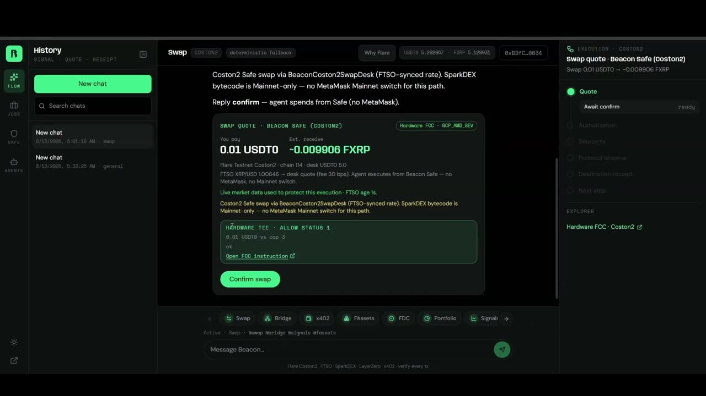

Tx: [`0x4e9d73f3…6ae2`](https://coston2-explorer.flare.network/tx/0x4e9d73f3b306d725338e80837c85c027a9822e53af3cc0d5d1bd281cbeb36ae2)

**DENY** — well-formed **100 USDT0 vs cap 10**. Hardware signed **status 0**. No execution. Not a malformed request. Not a frontend-only reject.

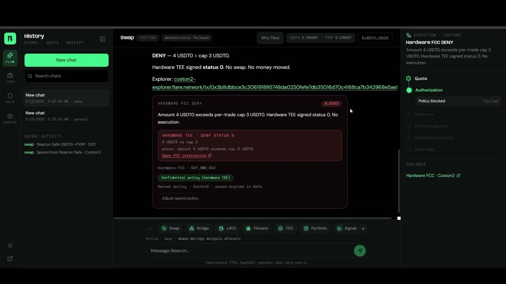

Tx: [`0x1f47b905…0ffc`](https://coston2-explorer.flare.network/tx/0x1f47b9050647e57f681193e71d5981ead51bf6015f4ffdfd6ce9ff761b620ffc)

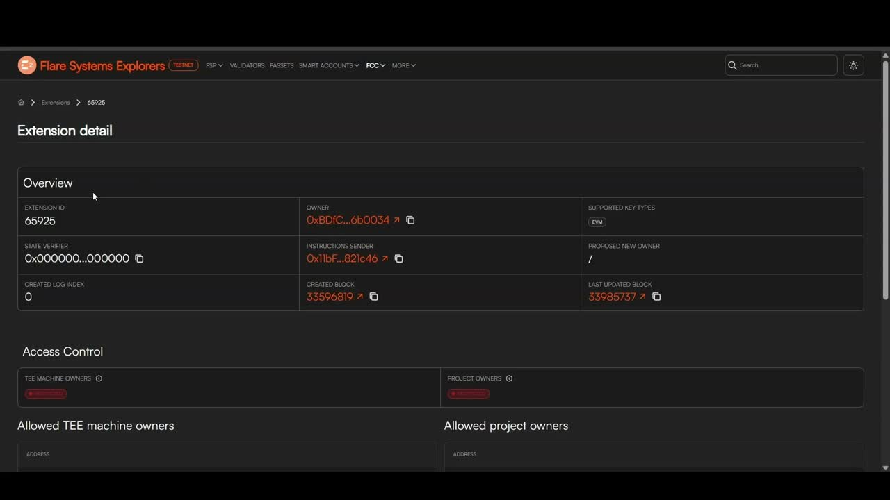

---

## Real Coston2 USDT0

Beacon pays with official faucet **USDT0 test** `0xC1A5B41512496B80903D1f32d6dEa3a73212E71F` (6 decimals).

- Faucet: https://faucet.flare.network/coston2 (C2FLR + USDT0 + FXRP)
- Not mainnet USD₮0
- Fixture `MockUSDT0.sol` is **tests / historical only**
- Faucet USDT0 has **no** `transferWithAuthorization` / EIP-3009

USDT0 is the EVM payment rail (Safe, Jobs, SwapDesk, x402). **FXRP** is the FAsset / LayerZero OFT rail. They are not interchangeable.

---

## Flow

Chat on `/flow`. Typical path: connect Coston2 wallet → fund Safe → quote → policy/FCC → execute from Safe → explorer link.

ALLOW and DENY from a live session:


*Swap quote under cap — hardware TEE status 1.*


*Over-cap spend — hardware TEE status 0. No execution.*

| Tile | What is live |
|------|----------------|
| Swap | USDT0 → FXRP from Beacon Safe via SwapDesk + FTSO guard |
| Bridge | FXRP OFT; confirm destination fill, not only “message sent” |
| Signals | Live FTSOv2 feeds |
| FAssets | Status + redeem prepare; mint is XRPL Core Vault / Xaman |
| x402 | Approve + facilitator pull |

---

## Agent Jobs

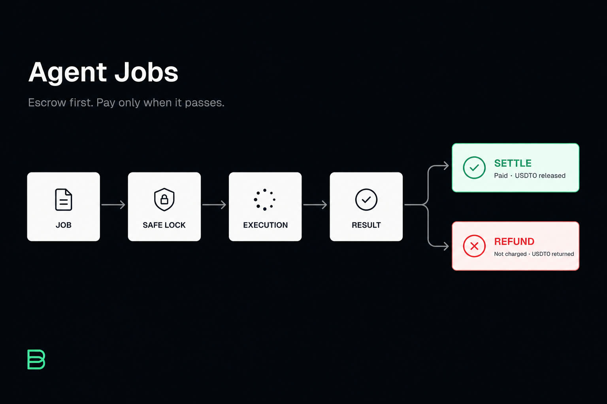

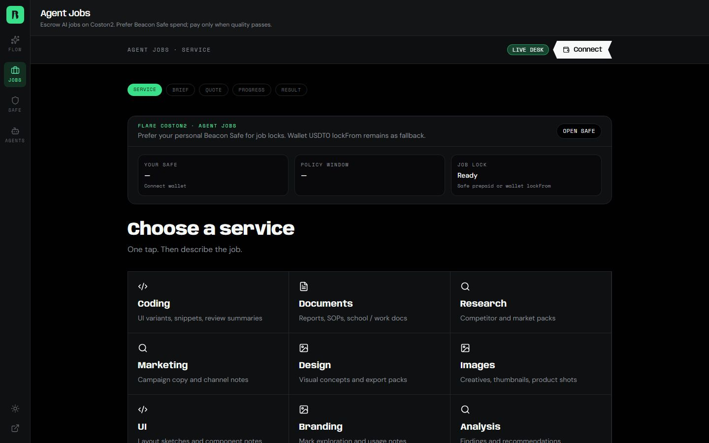

Job → Safe lock → execution → result → **settle** or **refund**.

| Outcome | Job | Lock | Settle / refund |
|---------|-----|------|-----------------|
| Paid | `7ad705e0-…` | [`0x41c602e3…9b25`](https://coston2-explorer.flare.network/tx/0x41c602e38147aee0ca1f401deb7e3ef2cfe71247ede4824456aac6b27d219b25) | [`0x175d13e2…5379`](https://coston2-explorer.flare.network/tx/0x175d13e2a4c07fa15b0e51c71e1102d2886a3e62734868172730f8d62b755379) |
| Not charged | `85d91c00-…` | [`0xe4e68fb5…68d3`](https://coston2-explorer.flare.network/tx/0xe4e68fb586d3f30d272c889de3b6ed1c04edc8dddf549864008c019cfb8568d3) | [`0x9f09bc5f…b4de`](https://coston2-explorer.flare.network/tx/0x9f09bc5f5602caaff5356956849515a4ba1950c0ccee2e2573579e5c5138b4de) |

---

## MCP

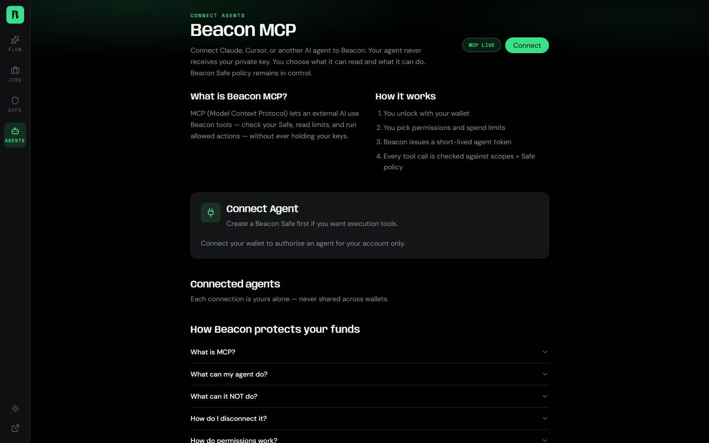

External agents call Beacon tools with a grant. They get **scopes**, not the private key.

- Connect page: https://beacon-desk.vercel.app/mcp
- Health: `GET https://beacon-api-97gl.onrender.com/v1/mcp/health`
- Endpoint: `POST /mcp` (Bearer access token)

Emergency pause on the Safe also revokes MCP grants for that wallet.

---

## Security model

1. The browser session authenticates. It does not custody keys for token transfers.
2. Beacon Safe is the spend envelope. Caps are on-chain.
3. Hardware FCC evaluates policy inside a TEE and signs ALLOW (1) or DENY (0).
4. FCC **cannot** move funds (`canMoveFunds: false`).
5. Settler / executor keys live on the API host, never in the frontend or MCP client.

---

## Demo and production

| Surface | URL |
|---------|-----|
| Desk | https://beacon-desk.vercel.app |
| API | https://beacon-api-97gl.onrender.com |
| Get Started | https://beacon-desk.vercel.app/start |
| Flow | https://beacon-desk.vercel.app/flow |
| Jobs | https://beacon-desk.vercel.app/flow/desk |
| Safe | https://beacon-desk.vercel.app/flow/security |
| MCP | https://beacon-desk.vercel.app/mcp |

```bash
curl -s https://beacon-api-97gl.onrender.com/health
curl -s https://beacon-api-97gl.onrender.com/v1/fcc/status
curl -s https://beacon-api-97gl.onrender.com/v1/flare/integrations
```

---

## Evidence

Canonical pack: [`docs/evidence/final-production-verification.json`](docs/evidence/final-production-verification.json)

| Claim | Link |
|-------|------|
| FCC extension | https://coston2-systems-explorer.flare.network/tee/extensions/65925 |
| ALLOW | https://coston2-explorer.flare.network/tx/0x4e9d73f3b306d725338e80837c85c027a9822e53af3cc0d5d1bd281cbeb36ae2 |
| DENY | https://coston2-explorer.flare.network/tx/0x1f47b9050647e57f681193e71d5981ead51bf6015f4ffdfd6ce9ff761b620ffc |
| FDC round 1423862 | https://coston2-systems-explorer.flare.network/voting-round/1423862?tab=fdc |
| FTSO feeds | https://coston2-systems-explorer.flare.network/price-feeds?tab=block-latency |
| x402 settle | https://coston2-explorer.flare.network/tx/0x104da10bd0b8e8bdb293bde89b9e856ce6bf3d1414470effc04850d464b59026 |
| LZ source | https://coston2-explorer.flare.network/tx/0x95b9b39da2f95772a16932ec03c9bf928cd66ef80ad27b93ab4991f7bef83d96 |
| LZ destination | https://sepolia.etherscan.io/tx/0xe0b3c54cb0ce37863763ea50c92b1ec3d66491591d2a552f9f81566a9cdfb0ca |
| Chrome swap spend | https://coston2-explorer.flare.network/tx/0x43d4bd6539bbcb652a28935dced0458453e4ef8fad922fdbf9252037d4cca35f |

### Coston2 contracts

| Component | Address |
|-----------|---------|
| USDT0 (faucet) | `0xC1A5B41512496B80903D1f32d6dEa3a73212E71F` |
| BeaconSafeFactory | `0x8250e3946fFAD7C3306E7286Cf82131E79038106` |
| BeaconEscrow | `0x59F9E2471BE3747b00fD53E0Cea828227345399C` |
| X402Facilitator | `0x1506f2177769EcB8Fa4903160c896E68f5d15747` |
| SwapDesk | `0xD926f5Bce2F89CD279aCa3648807607f6125986F` |
| Job registry | `0x100a3E24909DE25B9CAe75Ba665Be6F893b98889` |
| FXRP | `0x0b6A3645c240605887a5532109323A3E12273dc7` |
| FlareTeeManager | `0x1a9C4A0f9D76c0b1D91d22E24E573a9b377618aE` |
| InstructionSender | `0x11bFc67F6c5e7a1265b52292F5AE5a8f4B821c46` |

---

## Architecture

```
apps/web          Vite desk (Vercel)
apps/api          Fastify API (Render; embeds workers when Redis is set)
services/*        Optional standalone orchestrator / settler
packages/*        Shared libs, contracts, MCP, FDC, x402
fce-beacon/       FCC extension image (separate from the desk)
db/migrations/    Postgres
```

On-chain: USDT0, factory, vault, escrow, facilitator, SwapDesk, job registry. Off-chain: Postgres, Upstash Redis, Coston2 RPC, FDC verifier + DA layer, FCC ext-proxy.

---

## Local setup

**Prerequisites:** Node.js **20+**, npm, Git. Foundry only if you run contract tests.

### 1. UI against the live API (fastest judge path)

No database, no executor keys, no local TEE.

```bash
git clone https://github.com/goat-dev8/beacon.git
cd beacon
npm install
cp apps/web/.env.example apps/web/.env
npm run web
```

Open http://localhost:5173. The example frontend env already points at the production API.

You still need a Coston2 wallet and faucet funds to exercise Safe / Jobs / Flow pays.

### 2. Full local API

```bash
cp .env.example .env
```

Required in `.env` for the API to boot usefully:

| Need | Variables |
|------|-----------|
| Always | `SESSION_SECRET`, `CHAIN_ID=114`, `COSTON2_RPC_URL` |
| API + Jobs + MCP | `DATABASE_URL`, `DATABASE_URL_DIRECT`, `UPSTASH_REDIS_REST_URL`, `UPSTASH_REDIS_REST_TOKEN` |
| On-chain execute | `DEPLOYER_PRIVATE_KEY` / `SETTLER_PRIVATE_KEY` with C2FLR |
| Jobs generation | `AI_API_KEY` (or `AI_PROXY_URL` + `AI_PROXY_SECRET`) |
| Hardware FCC poll | `EXT_PROXY_URL` (Confidential Space proxy). Leave empty for shadow-only |

```bash
npm run db:migrate
npm run api          # http://localhost:3001
npm run web          # set VITE_API_URL=http://localhost:3001 in apps/web/.env
```

If Redis is configured, the API embeds pipeline + settler. Standalone:

```bash
npm run orchestrator
npm run settler
```

### 3. Tests and build

From the repo root:

```bash
npm test                 # vitest — 128 tests
npm run test:contracts   # Foundry. First run installs forge-std
npm run typecheck
npm run web:build
npm run lint -w @beacon/web
```

Contract tests need [Foundry](https://book.getfoundry.sh/getting-started/installation) (`forge` on PATH). `npm run test:contracts` installs `forge-std` on the first run.

Windows, if `forge` is missing from PATH:

```powershell
$env:Path += ";$env:USERPROFILE\.foundry\bin"
npm run test:contracts
```

`npm run ci` runs typecheck + unit tests + contract tests.

### 4. Coston2 wallet

1. MetaMask / Rabby: chain ID `114`, RPC `https://coston2-api.flare.network/ext/C/rpc`, explorer `https://coston2-explorer.flare.network`
2. https://faucet.flare.network/coston2 — C2FLR, USDT0, FXRP
3. Create a **new** Safe on factory `0x8250…8106`. Old MockUSDT0 Safes are historical.

### Local vs Coston2 vs hardware FCC

| Mode | What you get | What you need |
|------|----------------|----------------|
| Local UI + production API | Full desk against live Coston2 | Node 20, `npm run web` |
| Local API | Same code, your DB/Redis/keys | Postgres, Upstash, executor key |
| Coston2 pays | Real USDT0 / FXRP txs | Faucet + wallet |
| Hardware FCC | Signed ALLOW/DENY from TEE status 2 | Deployed Confidential Space + ext-proxy. **Not** a laptop TEE |

Do not claim a local hardware TEE. Without `EXT_PROXY_URL`, FCC stays shadow / status reporting.

---

## Current limitations

- **Coston2 testnet**, not Flare mainnet.
- **Smart Accounts** are a stub. Beacon Safe is a separate vault.
- **FAssets mint** is an XRPL / Xaman handoff, not an in-app USDT0 click.
- **MCP** proves grants and tools. A live Claude or Cursor session is yours to attach.
- **SparkDEX** swaps are Mainnet-only. Coston2 product swaps use SwapDesk + FTSO.
- Hardware FCC is a **Coston2 Flare Compute Extension**, not a claim that FCC is a finished public mainnet product.

---

## License

MIT. See [LICENSE](LICENSE).
