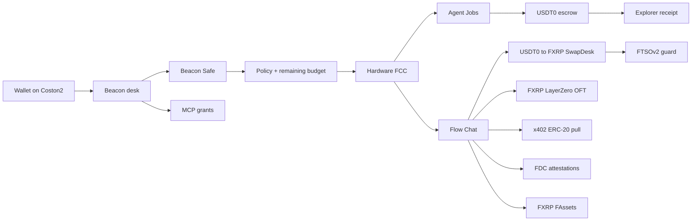

# Beacon

Flare AI OS on **Flare Testnet Coston2** (chain ID **114**).

Finish AI work. Pay only when it passes.

Beacon is a production desk for **policy-bounded AI spend** on Flare testnet. The core problem: an agent with a hot wallet can approve anything. Beacon puts a prepaid budget in **Beacon Safe**, evaluates spend against **policy + FCC**, then executes on Flare rails and leaves an explorer receipt.

**User flow:** connect a Coston2 wallet → create/fund a personal Safe → set caps/session → open Flow or Agent Jobs → quote → policy check → execute from Safe (or x402 wallet fallback) → receipt on [Coston2 explorer](https://coston2-explorer.flare.network).

Independent verification after the hardware FCC switch: [`docs/evidence/final-production-verification.json`](./docs/evidence/final-production-verification.json) (2026-08-12). Engineering log: [`history.md`](./history.md).

| Doc | Role |
|-----|------|
| [BEACON_MASTER.md](./BEACON_MASTER.md) | Master product / ops reference |
| [history.md](./history.md) | Engineering history (no secrets) |
| [ARCHITECTURE_AUDIT.md](./ARCHITECTURE_AUDIT.md) | Flare-native architecture and compliance |
| [PRODUCT.md](./PRODUCT.md) | Product direction and copy rules |
| [docs/HONESTY.md](./docs/HONESTY.md) | Runtime honesty flags (FCC / TEE) |
| [docs/FLARE_DEEP_RESEARCH.md](./docs/FLARE_DEEP_RESEARCH.md) | Sourced Flare-native research audit |
| [docs/FLARE_INTEGRATION_GAP_MATRIX.md](./docs/FLARE_INTEGRATION_GAP_MATRIX.md) | REAL / SIMULATED / STUB gap matrix |
| [docs/FLARE_NATIVE_BEACON_ARCHITECTURE.md](./docs/FLARE_NATIVE_BEACON_ARCHITECTURE.md) | Target execution architecture |
| [docs/FLARE_IMPLEMENTATION_PLAN.md](./docs/FLARE_IMPLEMENTATION_PLAN.md) | Phased implementation + acceptance gates |

---

## Architecture overview

Three product surfaces (see `ARCHITECTURE_AUDIT.md`):



| Surface | Route / role |
|---------|----------------|
| **Flow** | Chat OS: swap, bridge, research, signals, portfolio, risk, yield, FAssets, x402 micropays |
| **Agent Jobs** | `/flow/desk`: paid AI generation with escrow + receipt |
| **Safe** | `/flow/security`: create personal Safe, fund once, set policy; **per-wallet** balance for agent spends and jobs |
| **Connect Agents** | `/mcp` → `/flow/mcp`: authorize Claude / Cursor / MCP clients; no private keys leave the wallet |

### Payment paths (Agent Jobs)

**Primary (Beacon Safe):** create personal Safe → fund once (approve + `deposit` of official Coston2 USDT0) → owner sets policy → unlock one wallet-bound Agent session → `POST /v1/jobs/:id/approve-safe` (Bearer session; no per-job signature) → `vault.execute(transfer->escrow)` → `escrow.lockPrepaid` → generate → acceptance → release or refund to **that** vault.

**Fallback (wallet ERC-20):** user approves escrow → `escrow.lockFrom` → generate → release or refund to wallet.

Beacon Safe is a personal `BeaconAgentVault` per wallet, created via `BeaconSafeFactory`. It is **not** Flare Smart Accounts (those are XRPL personal accounts).

**Payment asset:** official Coston2 faucet **USDT0** `0xC1A5B41512496B80903D1f32d6dEa3a73212E71F` (6 decimals, name `USDT0 test`). This is real USDT0 on Flare Testnet Coston2 — not mainnet USD₮0 and not fixture MockUSDT0. Faucet: https://faucet.flare.network/coston2 (C2FLR + USDT0 + FXRP).

**USDT0 vs FXRP:** USDT0 is the EVM testnet payment rail (Safe, Jobs, Flow swap input, x402). FXRP is the FAsset / XRPL / LayerZero OFT rail. They are not interchangeable. Bridge stays FXRP. FAssets mint/redeem stays FXRP.

The browser session is authentication, not custody: it never signs token transfers. The allowlisted executor submits transactions, while the Safe contract enforces target/selector allowlists, per-transaction and rolling caps, pause, expiry, and replay nonces. Research and UI-truth audit: `docs/RESEARCH_AGENT_SAFE_SESSION_AND_REALITY.md`.

FCC on live Coston2 is **hardware-backed GCP Confidential Space** (`SIMULATED_TEE=false`, `FCC_MODE=verified`, `/info` platform `GCP_AMD_SEV`). TEE `0xA5E9a81044dd4d66384DE09CF95dB317fde5646d` is FlareTeeManager **PRODUCTION (status 2)**. Measured codeHash `0x2813e4ecd1478da4d997ddaf0cde8f33cc6f34d57b174dbae84b3ea56cb75806`. Stable ext-proxy: `https://policy-handful-outlast.ngrok-free.dev`. FCC cannot move funds (`canMoveFunds: false`). Evidence: `docs/evidence/hardware-fcc/STATUS.json`. Historical simulated TEE evidence remains under `docs/evidence/fcc-tee-production.json`.

**Flare-native execution (2026-08-09/10):** Safe job approve is **policy-before-spend**. FTSOv2 guards Safe swaps. Package `@beacon/flare` provides protocol adapters + `EvidenceEnvelope`.

**FDC (REAL + on-chain VERIFIED):** AddressValidity on Coston2 — FdcHub tx `0x2c62375359beeb5491c648260d79c2ec69a71fc2260bcb21027b7ad86be04516`, round `1420937` finalized, DA proof `isValid: true`, `FdcVerification.verifyAddressValidity` **staticCall** `onChainVerified: true` (evidence: `docs/evidence/fdc-address-validity-verify.json`).

**FCC (hardware + TEE PRODUCTION status 2):** TEE `0xA5E9a81044dd4d66384DE09CF95dB317fde5646d` on FlareTeeManager `0x1a9C4A0f9D76c0b1D91d22E24E573a9b377618aE`. InstructionSender `0x11bFc67F6c5e7a1265b52292F5AE5a8f4B821c46`. Extension `65925` / `0x…10185`. Hardware claim is only true when live `/info` shows `GCP_AMD_SEV` + `CONFIDENTIAL_SPACE`, measured codeHash `0x2813e4ecd1478da4d997ddaf0cde8f33cc6f34d57b174dbae84b3ea56cb75806`, FlareTeeManager status 2, and a stable proxy — not from env vars or UI labels alone. `canMoveFunds: false`. Value-protection: `POST /v1/fcc/policy/evaluate`.

Current production ALLOW (2026-08-12): instruction `0xac8bae0adae4c86839e71393857d259f57292239914c891fc2266ea66a136134`, tx [`0xa06806bb…face3`](https://coston2-explorer.flare.network/tx/0xa06806bb9add50f5cb9e8fbde6dcf459887851a5d622d82bf9aaa4b8dfaface3), TEE signed status 1. Current production DENY gate: Beacon policy amount-cap / per-job limit (100 USDT0 vs cap 10) — instruction **not** submitted on DENY. Historical empty-name SAY_HELLO DENY (`0xeb7f237c…`) is kept as TEE status-0 evidence; it is not the current policy-boundary proof.

**FAssets:** FXRP minting on Coston2 is an XRPL Testnet payment to the Core Vault plus FDC proof — not an in-app USDT0 click. Xaman is an optional XRPL wallet for that FAssets path only; it is **not** required for Safe, Jobs, Flow, MCP, or x402. Smart Accounts remain **STUB** (Beacon Safe ≠ Flare Smart Account). Do not invent custom `0xFE`/`0xFF` instructions.

See `docs/FLARE_FINAL_AUDIT.md` and `docs/FLARE_FINAL_IMPLEMENTATION_PLAN.md`.

### Runtime shape

```
apps/web          Vite React desk (Vercel in production)
apps/api          Fastify API; embeds pipeline + settler when Redis is available
services/orchestrator   Standalone job pipeline worker
services/settler        Standalone escrow settle / refund worker
packages/*        Shared libs, x402, quote, pipeline, contracts, ->
```

---

## Folder structure

```
beacon/
  apps/
    api/              Fastify API (`npm run api`)
    web/              Vite desk (`npm run web`)
  services/
    orchestrator/     Job pipeline loop (`npm run orchestrator`)
    settler/          Escrow settle / refund loop (`npm run settler`)
  packages/
    shared/           Env, vault, agents, FTSO, desks
    x402/             Facilitator / ERC-20 pull + historical EIP-3009 helpers
    quote/            Job quotes
    execution/        Execution helpers
    acceptance/       Acceptance judge
    pipeline/         Generation pipeline
    receipts/         Receipt builder
    flare/            Protocol adapters + EvidenceEnvelope
    fdc/              FDC client (API-wired; never invents proofs)
    smart-accounts/   Registry / memo helpers (STUB; ≠ Beacon Safe)
    contracts/        Foundry contracts + forge scripts
    remotion-pack/    Optional Remotion pack
  db/migrations/      SQL migrations (`npm run db:migrate`)
  scripts/            verify-env, e2e, deploy helpers
  fce-beacon/         FCC / confidential-compute scaffold (separate)
  api/ai/             Vercel AI proxy route (production AgentRouter hop)
  .env.example        Root / API / worker env names
  apps/web/.env.example Frontend Vite env names
```

---

## Requirements

- **Node.js 20+** (`engines.node` in root `package.json`)
- npm (workspaces)
- Postgres (`DATABASE_URL` / `DATABASE_URL_DIRECT`) for API and workers
- Upstash Redis REST (`UPSTASH_REDIS_REST_URL` + `UPSTASH_REDIS_REST_TOKEN`) for job locks and settle queue
- MetaMask (or another EIP-1193 wallet) for Coston2 testing
- **Foundry** (optional): only needed for `forge test` / contract deploy scripts under `packages/contracts`

---

## Installation

From the monorepo root (`beacon/`):

```bash
npm install
```

Optional env check (requires a filled root `.env`):

```bash
npm run verify:env
```

Optional DB migrate:

```bash
npm run db:migrate
```

---

## Environment variables

**Never commit real secrets.** Copy examples, fill locally, keep `.env` out of git.

### Root `.env` (API, workers, scripts)

Copy from [`.env.example`](./.env.example). Groups:

| Group | Names (see `.env.example`) |
|-------|----------------------------|
| App | `NODE_ENV`, `APP_NAME`, `APP_URL`, `API_URL`, `API_PORT`, `WEB_PORT`, `LOG_LEVEL`, `SESSION_SECRET`, `ANALYTICS_SALT`, `CHAIN_ID`, `NETWORK_NAME` |
| Coston2 | `COSTON2_RPC_URL`, `COSTON2_WSS_URL`, `COSTON2_EXPLORER_URL`, `COSTON2_FAUCET_URL`, `FLARE_CONTRACT_REGISTRY`, `EXPECTED_*` |
| Keys | `DEPLOYER_PRIVATE_KEY`, `DEPLOYER_ADDRESS`, `SETTLER_PRIVATE_KEY`, `SETTLER_ADDRESS`, `DEPLOYMENT_PRIVATE_KEY`, `INITIAL_OWNER`, `PROXY_PRIVATE_KEY` |
| Data | `DATABASE_URL`, `DATABASE_URL_DIRECT`, `DATABASE_SSL`, `REDIS_URL`, `UPSTASH_REDIS_REST_URL`, `UPSTASH_REDIS_REST_TOKEN` |
| AI | `AI_BASE_URL`, `AI_API_KEY`, `AI_PROXY_URL`, `AI_PROXY_SECRET`, `AI_MODEL_*`, `AI_REQUIRE_REAL`, OpenAI/Anthropic mirrors |
| Billing contracts | `X402_TOKEN_ADDRESS`, `X402_FACILITATOR_ADDRESS`, `X402_PAYEE_ADDRESS`, `BEACON_JOB_REGISTRY`, `BEACON_ESCROW`, `BEACON_CREDIT`, `BEACON_AGENT_VAULT_ADDRESS`, `VAULT_EXECUTOR`, `BEACON_SWAP_DESK_ADDRESS` |
| FCC | `FCC_MODE`, `SIMULATED_TEE`, `LOCAL_MODE`, `EXT_PROXY_URL`, `TEE_ID`, `FLARE_TEE_MANAGER`, -> |
| Feature flags | `ENABLE_API`, `ENABLE_FCC`, `ENABLE_PIPELINE`, `ENABLE_SETTLER`, `ENABLE_FUNDING`, `ENABLE_WEB` |

`npm run verify:env` treats these as required when checking: `NODE_ENV`, `API_PORT`, `CHAIN_ID`, `COSTON2_RPC_URL`, `DATABASE_URL`, `DATABASE_URL_DIRECT`, `SESSION_SECRET`.

Defaults in code (when unset): `APP_URL=http://localhost:5173`, `API_URL=http://localhost:3001`, `API_PORT=3001`, `CHAIN_ID=114`, public Coston2 RPC.

### Frontend `apps/web/.env`

Copy from [`apps/web/.env.example`](./apps/web/.env.example):

| Name | Purpose |
|------|---------|
| `VITE_API_URL` | API base (local `http://localhost:3001` or production Render URL) |
| `VITE_RPC_URL` | Coston2 RPC |
| `VITE_X402_TOKEN_ADDRESS` | Official Coston2 faucet USDT0 |
| `VITE_X402_FACILITATOR_ADDRESS` | X402Facilitator |
| `VITE_X402_PAYEE_ADDRESS` | Payee / settler address |
| `VITE_BEACON_JOB_REGISTRY` | Job registry |
| `VITE_BEACON_ESCROW` | Escrow (must match root `BEACON_ESCROW`) |
| `VITE_BEACON_SAFE_FACTORY_ADDRESS` | Personal Safe factory |
| `VITE_BEACON_AGENT_VAULT_ADDRESS` | Legacy shared vault (optional) |

Keep `VITE_BEACON_ESCROW` aligned with root `BEACON_ESCROW`. Live prepaid escrow is `0x59F9E2471BE3747b00fD53E0Cea828227345399C` (USDT0 rails). Evidence: `docs/evidence/usdt0-rails-deploy.json`.

---

## Flare Coston2 setup

| Field | Value |
|-------|--------|
| Network | Flare Testnet Coston2 |
| Chain ID | `114` |
| RPC | `https://coston2-api.flare.network/ext/C/rpc` |
| Explorer | `https://coston2-explorer.flare.network` (also `https://coston2.testnet.flarescan.com` in some Safe/desk links) |
| Faucet | `https://faucet.flare.network/coston2` |
| Dev tools | https://dev.flare.network/network/developer-tools?network=coston2 |

### MetaMask

1. Add network: Coston2, chain ID `114`, RPC above, explorer above.
2. Fund the wallet from the official faucet: https://faucet.flare.network/coston2 — claim **C2FLR** (gas), **USDT0** (Safe / Jobs / Flow / x402), and **FXRP** if you will test FAssets or OFT.
3. Create a **new** Beacon Safe after the USDT0 factory deploy (`0x8250…8106`). Old MockUSDT0 Safes are historical and are not migrated by copying database balances.
4. Stay on chain **114**. Product agent Safe swaps are Coston2-only; SparkDEX Mainnet (14) is not the default desk path. SparkDEX SwapRouter bytecode is empty on Coston2.

---

## Deploy contracts (Foundry)

Contracts live in `packages/contracts` (`foundry.toml` RPC alias `coston2` = `${COSTON2_RPC_URL}`).

Install Foundry separately, then from `packages/contracts`:

```bash
# Unit tests (also: npm run test:contracts from monorepo root)
forge test
```

Scripts under `packages/contracts/script/`:

| Script | Purpose | Env used by script |
|--------|---------|---------------------|
| `Deploy.s.sol` | Fixture-only full stack (deploys MockUSDT0 — not live) | `DEPLOYMENT_PRIVATE_KEY`, `X402_PAYEE_ADDRESS` |
| `DeployUsdt0Rails.s.sol` | Live Coston2 rails on official faucet USDT0 | `DEPLOYMENT_PRIVATE_KEY`, `X402_TOKEN_ADDRESS=0xC1A5…`, `X402_PAYEE_ADDRESS`, `EXPECTED_FXRP_TOKEN` |
| `DeployEscrowPrepaid.s.sol` | Redeploy prepaid `BeaconEscrow` on existing token | `DEPLOYMENT_PRIVATE_KEY`, `X402_TOKEN_ADDRESS`, `X402_PAYEE_ADDRESS` |
| `DeployAgentVault.s.sol` | Vault only on existing token | `DEPLOYMENT_PRIVATE_KEY`, `X402_TOKEN_ADDRESS` |
| `DeploySwapDesk.s.sol` | Coston2 USDT0→FXRP swap desk | `DEPLOYMENT_PRIVATE_KEY`, `X402_TOKEN_ADDRESS`, `EXPECTED_FXRP_TOKEN` |

Example broadcast (loads `[rpc_endpoints].coston2` from `foundry.toml`):

```bash
cd packages/contracts
forge script script/Deploy.s.sol:Deploy --rpc-url coston2 --broadcast
forge script script/DeployEscrowPrepaid.s.sol:DeployEscrowPrepaid --rpc-url coston2 --broadcast
forge script script/DeployAgentVault.s.sol:DeployAgentVault --rpc-url coston2 --broadcast
forge script script/DeploySwapDesk.s.sol:DeploySwapDesk --rpc-url coston2 --broadcast
```

After deploy, set the printed addresses into root `.env` and matching `VITE_*` values. Do not redeploy casually against production without updating Render + Vercel env.

### Current Coston2 addresses (official faucet USDT0 rails)

Evidence: [`docs/evidence/usdt0-rails-deploy.json`](./docs/evidence/usdt0-rails-deploy.json). Explorer: https://coston2-explorer.flare.network

| Component | Address | Deploy tx |
|-----------|---------|-----------|
| **USDT0** (official faucet) | `0xC1A5B41512496B80903D1f32d6dEa3a73212E71F` | Flare faucet token |
| X402Facilitator | `0x1506f2177769EcB8Fa4903160c896E68f5d15747` | [`0xe26ef148…cb29`](https://coston2-explorer.flare.network/tx/0xe26ef14849ea4316e1ced95796cdce902311fe20fa1fcb4d5a178ad462b8cb29) |
| BeaconEscrow | `0x59F9E2471BE3747b00fD53E0Cea828227345399C` | [`0x71376762…3605`](https://coston2-explorer.flare.network/tx/0x713767624ed51b9a4be71b77b0708de2e689dd3ee0f74210ad79edf165e73605) |
| BeaconSafeFactory | `0x8250e3946fFAD7C3306E7286Cf82131E79038106` | [`0x40d00ab8…3638`](https://coston2-explorer.flare.network/tx/0x40d00ab8c82c4ca1afa7ca99d7aeccc2073ab4ee8bec222f1db3c512db273638) |
| BeaconCoston2SwapDesk | `0xD926f5Bce2F89CD279aCa3648807607f6125986F` | [`0x4f0278fe…5b01`](https://coston2-explorer.flare.network/tx/0x4f0278feae293b79a2adecc362a166ecba71f8547885cea9555677f4abdd5b01) |
| FXRP seed (5 FXRP → desk) | — | [`0x4fa9353f…d76d`](https://coston2-explorer.flare.network/tx/0x4fa9353f36a8c4e0908a4cb477e1f7a004bdb8ea737c301ec9a58515007fd76d) |
| Executor / escrow owner / payee | `0xBDfCeE82Bd42FEfA58ee850B3709636a8B6b0034` | — |
| Job registry | `0x100a3E24909DE25B9CAe75Ba665Be6F893b98889` | unchanged |
| FXRP (FTestXRP) | `0x0b6A3645c240605887a5532109323A3E12273dc7` | FAsset |
| FlareTeeManager | `0x1a9C4A0f9D76c0b1D91d22E24E573a9b377618aE` | — |
| InstructionSender | `0x11bFc67F6c5e7a1265b52292F5AE5a8f4B821c46` | — |
| Hardware TEE (status 2) | `0xA5E9a81044dd4d66384DE09CF95dB317fde5646d` | extension 65925 |

Historical MockUSDT0 `0x6fd8…Fe86c` and the previous factory/escrow/desk remain on-chain as **HISTORICAL**. They are not the live product rail. Fixture contract: `packages/contracts/src/mocks/MockUSDT0.sol`.

---

## Run locally

Use four terminals from the monorepo root after `npm install` and env setup.

### Frontend

```bash
npm run web
```

Runs `npm run dev -w @beacon/web` (Vite). Point `VITE_API_URL` at local API or production Render.

### API

```bash
npm run api
```

Runs `tsx apps/api/src/index.ts`. Listens on `PORT` or `API_PORT` (default `3001`).

If Upstash Redis is configured, the API **embeds** pipeline + settler loops (`ENABLE_PIPELINE` / `ENABLE_SETTLER` default on unless set to `false`). If Redis is missing, jobs will not advance until workers run elsewhere.

### Workers (standalone)

```bash
npm run orchestrator
npm run settler
```

- `orchestrator` -> `tsx services/orchestrator/src/index.ts` (AUTHORIZED -> generate -> accept)
- `settler` -> `tsx services/settler/src/index.ts` (settle / refuse escrow from Redis `q:settle`)

For local isolation you can run standalone workers and disable embedded ones with `ENABLE_PIPELINE=false` / `ENABLE_SETTLER=false` on the API process. Do not run duplicate settlers against the same queue without understanding lock behavior.

### Useful checks

```bash
npm run typecheck
npm test
npm run test:contracts
npm run web:build
npm run ci
```

---

## Production

From `history.md` / `ARCHITECTURE_AUDIT.md` / `PRODUCTION_AUDIT.md`:

| Surface | Host | URL |
|---------|------|-----|
| Desk (Vercel `beacon-desk`) | Vercel | https://beacon-desk.vercel.app |
| API (`beacon-api`) | Render | https://beacon-api-97gl.onrender.com |

Notes:

- Web build: `vercel.json` -> `npm run build -w @beacon/web`, output `apps/web/dist`.
- API image: `Dockerfile` -> `npx tsx apps/api/src/index.ts` (embedded workers when Redis is set).
- Production AI egress uses Vercel Node proxy: `AI_PROXY_URL` -> `https://beacon-desk.vercel.app/api/ai/proxy` (see history / production audit). Do not point live Render at localhost or ephemeral tunnels.
- `render.yaml` documents the `beacon-api` service shape (Coston2 `CHAIN_ID=114`, `SIMULATED_TEE=false`, `FCC_MODE=verified`).

---

## What is live (and how to verify)

Do not treat marketing copy as proof. Each claim below has a live source.

| Topic | What is live | Source |
|-------|----------------|--------|
| **Beacon** | Desk + API on Coston2 114 | https://beacon-desk.vercel.app · https://beacon-api-97gl.onrender.com |
| **Problem / money path** | Wallet → Safe → policy/FCC → Flare → receipt | `/start` (11 steps); `apps/web/src/pages/GetStartedPage.tsx` |
| **Beacon Safe** | Personal `BeaconAgentVault` per wallet on official USDT0 factory | `/flow/security` · factory `0x8250…8106` |
| **Policy boundary** | Server Redis policy + on-chain vault caps; fail-closed | `POST /v1/fcc/policy/evaluate` · `apps/api/src/securityPolicy.ts` |
| **Agent Jobs** | Escrow lock from Safe → generate → accept → settle/refund | `/flow/desk` · escrow `0x59F9…399C` |
| **Flow** | Chat OS: swap, bridge, signals, FAssets, x402 | `/flow` |
| **MCP** | OAuth + scoped tools; **no private key to the agent** | `/flow/mcp` · `GET /v1/mcp/health` |
| **x402** | HTTP 402 + Coston2 USDT0 ERC-20 approve/pull | Flow x402 cards; facilitator `0x1506…5747` |
| **FTSO** | Live FTSOv2 feeds guard Safe swaps | `GET /v1/ftso/guard` · Flow Signals · [price feeds](https://coston2-systems-explorer.flare.network/price-feeds?tab=block-latency) |
| **FDC** | Verifier + DA configured; proofs never invented | `GET /v1/fdc/status` · [attestation explorer](https://coston2-systems-explorer.flare.network/attestation-request) |
| **FCC** | Hardware GCP Confidential Space (AMD SEV) | `GET /v1/fcc/status` + `/v1/fcc/lifecycle` + TEE `/info` + [extension 65925](https://coston2-systems-explorer.flare.network/tee/extensions/65925) |
| **FAssets** | FTestXRP live; mint = docs handoff; redeem prepare | `GET /v1/agents/fassets` · [FAssets explorer](https://coston2-systems-explorer.flare.network/fassets) |
| **LayerZero** | Agent OFT FXRP → Sepolia | Flow Bridge; FXRP rail (not USDT0) |
| **FTSO** | Live FTSOv2 feeds guard Safe swaps | `GET /v1/ftso/guard` · Flow Signals |
| **FDC** | Verifier + DA configured; proofs never invented | `GET /v1/fdc/status` · AddressValidity evidence `docs/evidence/fdc-address-validity-verify.json` · round [1420937](https://coston2-systems-explorer.flare.network/voting-round/1420937?tab=fdc) |
| **FCC** | Hardware GCP Confidential Space (AMD SEV) | `GET /v1/fcc/status` + `/v1/fcc/lifecycle` + TEE `/info` + [extension 65925](https://coston2-systems-explorer.flare.network/tee/extensions/65925) |
| **FAssets** | FTestXRP live; mint = docs handoff; redeem prepare | `GET /v1/agents/fassets` · Flow FAssets |
| **LayerZero** | Agent OFT FXRP → Sepolia | Flow Bridge; source tx in evidence file |
| **Hardware TEE** | status 2, `GCP_AMD_SEV`, measured codeHash | See “Verify hardware FCC” below |
| **Security model** | FCC cannot move funds; Safe is spend boundary | `canMoveFunds: false` on FCC endpoints; vault `execute` allowlists |
| **Smart Accounts** | **STUB** (not Beacon Safe) | `packages/smart-accounts` · honesty docs |

Latest independent pass: [`docs/evidence/final-production-verification.json`](./docs/evidence/final-production-verification.json).

### Verify hardware FCC (do not stop at env)

1. `GET https://beacon-api-97gl.onrender.com/v1/fcc/status` — expect `simulatedTee=false`, `mode=verified`, `hardwareClaim=true`, `attestationKind=hardware`, `teeMachineStatus=2`, `platformAscii=GCP_AMD_SEV`, `codeHash=0x2813e4ec…5806`, `canMoveFunds=false`.
2. `GET /v1/fcc/lifecycle` — `extProxyReachable=true`, `extProxyEphemeral=false`, same TEE id.
3. `GET https://policy-handful-outlast.ngrok-free.dev/info` with `User-Agent: BeaconVerify/1.0` and `ngrok-skip-browser-warning: true`. Decode attestation JWT: `hwmodel=GCP_AMD_SEV`, `swname=CONFIDENTIAL_SPACE`.
4. On-chain: FlareTeeManager `getTeeMachine` for `0xA5E9…646d` status 2 and registered URL. Explorer: https://coston2-systems-explorer.flare.network/tee/extensions/65925
5. Status 2, UI badges, or `SIMULATED_TEE=false` **alone** are not a hardware proof.

### Reproduce key flows (Coston2 testnet)

- **Swap:** Flow → Swap. If quote says “Seed the desk,” SwapDesk FXRP inventory is too low for 1 USDT0; use a small size (this pass: 0.01) or seed the desk. Confirm FTSO age, then Execute from Beacon Safe. Open fulfill tx on explorer.
- **Bridge:** Flow → Bridge. Size must fit executor FXRP + C2FLR fee. Confirm LZ quote, execute, open source tx. Destination OFTReceived can lag — do not invent COMPLETE.
- **Jobs:** `/flow/desk` → Coding or Images → brief → quote → Safe approve (active session) → wait CLOSED. Check lock/spend/settle or refund hashes. Quality FAIL/generation_failed must refund, not silent success.
- **Policy DENY:** `POST /v1/fcc/policy/evaluate` with amount above Safe/app cap. Expect `decision=DENY` and `onChainInstruction=null`.
- **MCP:** open `/flow/mcp` and `GET /v1/mcp/health`. Full Claude/Cursor tool execution is **your** independent test; this repo’s smoke test does not claim it.

---

## Verify deployments / explorer links

1. **API health:** `GET https://beacon-api-97gl.onrender.com/health` (and FCC status endpoints when enabled; see `docs/HONESTY.md`).
2. **Desk:** open https://beacon-desk.vercel.app (Flow, Jobs / Agent Jobs, Safe, Connect Agents `/mcp`).
3. **MCP health:** `GET https://beacon-api-97gl.onrender.com/v1/mcp/health` and `POST /mcp` with a user Bearer grant (never share refresh tokens in public chats).
4. **On-chain:** open contract or tx on  
   https://coston2-explorer.flare.network  
   or  
   https://coston2.testnet.flarescan.com  
   Confirm bytecode at `BEACON_ESCROW` / `BEACON_AGENT_VAULT_ADDRESS` matches env.
5. **x402 smoke:** unpaid agent resource returns HTTP **402** with Coston2 / USDT0 / facilitator fields. Settle uses ERC-20 approve + `settleTransferFrom` (faucet USDT0 has no EIP-3009).
6. **Env alignment:** root `BEACON_ESCROW` == `VITE_BEACON_ESCROW` == live prepaid escrow.
7. **Evidence pack:** `docs/evidence/final-production-verification.json` (no secrets).

Example explorer bases:

- Tx: `https://coston2-explorer.flare.network/tx/<hash>`
- Address: `https://coston2-explorer.flare.network/address/<address>`

---

## Common errors

| Symptom | Likely cause | What to check |
|---------|--------------|---------------|
| Jobs stuck AUTHORIZED / no progress | Redis missing or workers off | Upstash env; API log `[workers]`; or run `npm run orchestrator` / `npm run settler` |
| ->Not charged-> after Safe pay | Generation aborted -> escrow refund (not quality FAIL) | AI proxy/key; `AI_REQUIRE_REAL`; job events `generation_failed` (see history / Agent Jobs research) |
| `BEACON_ESCROW not configured` | Missing escrow env | Set `BEACON_ESCROW` (and matching `VITE_*`) |
| Safe balance / policy wrong or empty | Vault unset or wrong address | `BEACON_AGENT_VAULT_ADDRESS` / `VITE_BEACON_AGENT_VAULT_ADDRESS` |
| MetaMask wrong network / Mainnet switch | Not on Coston2 114 | Add/switch chain 114; Safe path stays Coston2 |
| Deposit / x402 fails | Missing faucet USDT0 or allowance | Claim https://faucet.flare.network/coston2 then approve the Safe / facilitator |
| Settler / approve fails | Missing `SETTLER_PRIVATE_KEY` or `DEPLOYER_PRIVATE_KEY` | Key must own escrow / have gas (C2FLR) |
| AI hard fail with `AI_REQUIRE_REAL` | Proxy/key/WAF | Production uses Vercel `AI_PROXY_URL`; local needs working `AI_*` |
| FCC honesty mismatch | Claiming simulated FCC in production | Keep `SIMULATED_TEE=false` / `FCC_MODE=verified`; `/v1/fcc/status` must show `hardwareClaim: true` |

---

## Security best practices

- Never commit `.env`, `.env.local`, or private keys. Use `.env.example` names only in docs.
- Treat `SETTLER_PRIVATE_KEY` / `DEPLOYER_PRIVATE_KEY` / `DEPLOYMENT_PRIVATE_KEY` as production secrets (escrow owner, vault executor gas, deploys).
- Keep `SESSION_SECRET` and `AI_PROXY_SECRET` long and unique per environment.
- Do not forge EIP-3009 as the Safe. Safe jobs use `vault.execute` + `lockPrepaid` only. Live faucet USDT0 has no EIP-3009.
- Align escrow/vault addresses across Render, Vercel, and local before testing pays.
- Prefer official Flare RPC/explorer/faucet URLs.
- Production: no laptop tunnels for AI/API. Render + Vercel only (see history).
- Pause Safe / tighten policy when demoing with a funded vault.
- Frontend never holds `DEPLOYER_PRIVATE_KEY` / settler keys. MCP copy and Connect Agents UI must not expose a private key.
- Production FCC: `SIMULATED_TEE=false`. Do not advertise hardware while simulated.

---

## Further reading

- [BEACON_MASTER.md](./BEACON_MASTER.md)
- [history.md](./history.md)
- [ARCHITECTURE_AUDIT.md](./ARCHITECTURE_AUDIT.md)
- [docs/HONESTY.md](./docs/HONESTY.md)
- Flare x402: https://dev.flare.network/fxrp/token-interactions/x402-payments
- Flare gasless / EIP-3009: https://dev.flare.network/network/guides/gasless-usdt0-transfers

