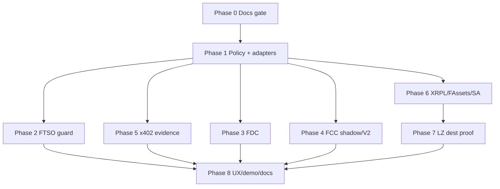

# Flare-Native Beacon — Implementation Plan

**Docs only until Phase 0 gate passes.** Do not invent contracts, APIs, or transaction hashes.  
**Honesty labels:** `REAL` | `SIMULATED` | `STUB` | `NOT AVAILABLE`  

**Companions:**  
[`FLARE_DEEP_RESEARCH.md`](./FLARE_DEEP_RESEARCH.md) · [`FLARE_INTEGRATION_GAP_MATRIX.md`](./FLARE_INTEGRATION_GAP_MATRIX.md) · [`FLARE_NATIVE_BEACON_ARCHITECTURE.md`](./FLARE_NATIVE_BEACON_ARCHITECTURE.md)

---

## 0. Locked priorities

| Priority | Work |
| --- | --- |
| **P0** | Policy-before-spend; FTSO guard; evidence-bound x402; real FDC where claimed |
| **P1** | FCC shadow → opt-in V2 Safe with on-chain verified TEE auth; XRPL/FAssets/Smart Accounts parallel rail |
| **P2** | LayerZero compose only with destination proof |

Preserve Flow, Safe V1, Jobs, and AI router. Expand via adapters + flags.

---

## Phase 0 — Research artifacts and correctness gate

### Deliverables (this phase)

| File | Done when |
| --- | --- |
| `docs/FLARE_DEEP_RESEARCH.md` | Sourced audit + honesty map |
| `docs/FLARE_INTEGRATION_GAP_MATRIX.md` | Weighted scoring table |
| `docs/FLARE_NATIVE_BEACON_ARCHITECTURE.md` | Diagrams + trust boundaries |
| `docs/FLARE_IMPLEMENTATION_PLAN.md` | Phases + acceptance gates |

### Acceptance gate 0

- [x] All four docs agree on REAL / SIMULATED / STUB / NOT AVAILABLE  
- [x] No claim that Flow FDC is live  
- [x] FCC labeled not fully public production + SIMULATED_TEE  
- [x] Smart Account local `0xfe`/`0xff` conflict documented as rename prerequisite  
- [x] P0 policy-before-spend named with path `apps/api/src/index.ts`  
- [x] No invented tx hashes  

### Rollback

N/A (docs only).

**Status (2026-08-09):** Phase 0 complete. Implementation proceeded: policy-before-spend fixed; `@beacon/flare` shipped; FTSO guard on Safe swaps; FDC/FCC/x402 evidence API routes; Smart Account memo markers renamed.

---

## Phase 1 — Security and protocol adapter foundation

### File-level scope

| Area | Paths (expected) |
| --- | --- |
| P0 policy order | `apps/api/src/index.ts` — both `/v1/jobs/:id/approve` (safe mode) and `/v1/jobs/:id/approve-safe` |
| Policy helpers | `apps/api/src/securityPolicy.ts` |
| Safe lock | `packages/shared/src/safeJobLock.ts` (call order from API; keep 2-tx honesty) |
| Adapters | New narrow modules under `packages/flare/` (or equivalent): PriceOracle, Attestation, FAssets, SmartAccount, Payment, CrossChain, experimental ConfidentialCompute |
| Evidence | Shared `EvidenceEnvelope` type + builders |
| Flags | Executable env flags for FDC, FCC shadow/enforced, Smart Accounts, FAssets direct mint, cross-chain compose |
| Registry | Resolve via ContractRegistry `0xaD67FE66660Fb8dFE9d6b1b4240d8650e30F6019`; hardcoded addresses only as verified fallbacks with source/date metadata |

### Work items

1. Call `assertPolicyAllows` (and any future enforced FCC check) **before** `executeSafeJobLock`.  
2. Negative tests: denied policy → **zero** spend/lock txs → **zero** spend accounting.  
3. Introduce adapters without changing default product behavior.  
4. Startup validation: chain id 114, bytecode/interface checks where feasible.

### Acceptance gate 1

- [ ] Both Safe approve routes policy-first  
- [ ] Unit/integration negative tests green  
- [ ] Adapters compile behind flags; defaults preserve current UX  
- [ ] `npm run typecheck` + targeted API tests pass  

### Rollback

Revert API route order only; adapters remain unused if flagged off.

### Deployments

None required for policy-order fix (API-only).

---

## Phase 2 — FTSO Decision Engine

### File-level scope

| Area | Paths |
| --- | --- |
| FTSO client | `packages/shared/src/ftso.ts` |
| Swap path | `packages/shared/src/safeSwap.ts`, SwapDesk `0x36c17ca6Aa2b61b13f7c4B5A59629320a8B4dF29` |
| Guard contract | New `BeaconExecutionGuard` (or equivalent) using registry-resolved FTSOv2 |
| UI | Flow / Safe cards: show allow/block reason from guard |

### Work items

1. Timestamp-aware feed reads; stale/deviation errors.  
2. Volatility / stability metadata for heuristics and guards.  
3. On-chain guard: freshness, max quote deviation, slippage, owner risk thresholds.  
4. Wire guard first to SwapDesk / safe swap, then dynamic x402 pricing surfaces.  
5. Feature flag: preserve current behavior until live Coston2 tests pass.  
6. Fail closed for value-moving guarded actions; informational surfaces may degrade read-only.

### Acceptance gate 2

- [ ] Stale feed rejects guarded spend in tests  
- [ ] Live Coston2 smoke: registry → FtsoV2 → guard decision visible in receipt  
- [ ] Flag-off path matches pre-change behavior  

### Rollback

Disable guard flag; SwapDesk continues owner-synced rates without hard block.

### Deployments

Deploy guard module on Coston2 when ready; record **real** address + deploy tx only after broadcast (never invent hashes).

---

## Phase 3 — FDC Evidence Engine

### Honesty prerequisite

Today `packages/fdc` `FdcClient` is **not** imported by Flow/API product paths → `STUB`. Do not update README/master claims until gate 3 passes.

### File-level scope

| Area | Paths |
| --- | --- |
| Client | `packages/fdc/src/index.ts` — replace guessed prepare/submit with official lifecycle |
| Persistence | DB tables for request bytes, round, source, status, proof hash, verify tx, timeout, retries |
| Consumers | Optional `BeaconEvidenceGate` contract |
| UX | Flow cards: requested / finalized / verified / rejected / timed-out |
| Official refs | https://dev.flare.network/fdc/overview |

### Work items

1. Encode → `FdcHub.requestAttestation` → durable round state → Relay → DA proof → `FdcVerification`.  
2. Only three adapters initially: `EVMTransaction`, Payment/XRPLPayment, allowlisted `Web2Json`.  
3. Never treat structural proof as sole business auth.  
4. Keep FDC out of standard Jobs unless evidence-gated job type selected.

### Acceptance gate 3

- [ ] At least one attestation type: request → verify on Coston2 with real hashes in evidence manifest  
- [ ] Flow shows accurate state machine (no “verified” without verify tx)  
- [ ] Product docs may claim FDC **only** for that path  

### Rollback

Flag off AttestationAdapter; UI hides FDC sections; package may remain unused (`STUB` again).

### Deployments

Evidence gate consumer only when needed; use expected hub/verification addresses from env after registry validation (`EXPECTED_FDC_HUB`, `EXPECTED_FDC_VERIFICATION`).

---

## Phase 4 — FCC confidential policy authorization

### Honesty prerequisite

Official: FCC **not yet fully public production** — https://dev.flare.network/fcc/overview  
Beacon: `SIMULATED_TEE` / `FccExtensionClient` scaffold (`packages/fdc/src/fcc.ts`).

### File-level scope

| Area | Paths |
| --- | --- |
| Policy-before-spend | Must already be done (Phase 1) |
| Shadow FCE | Beacon Policy FCE from official scaffold |
| V2 vault | `packages/contracts/src/BeaconAgentVaultV2.sol` (new) |
| API | FCC status already exists; extend for shadow compare metrics |
| UX | Safe: V1 vs opt-in V2; honesty badge |

### Work items

1. Shadow mode: signed `{allow, actionHash, policyHash, policyEpoch, nonce, validAfter, validBefore, reasonCommitment}` — **cannot move funds**.  
2. Compare FCC vs Redis/on-chain policy; log mismatches.  
3. Opt-in V2: `executeAuthorized` binds chainId, vault, target, calldata hash, max spend, nonce, expiry, policy epoch, extension ID, machine identity, accepted code hash.  
4. Keep V1 on-chain target/selector/per-call/window limits.  
5. Owner pause/withdraw, epoch invalidation, machine/code revocation, signer rotation, **no automatic fail-open**.  
6. If hardware unavailable: stop at useful signed shadow/V2 simulation labeled `SIMULATED_TEE`.

### Acceptance gate 4

- [ ] Shadow never produces spend txs by itself  
- [ ] V1 Safes untouched; migration is explicit UX  
- [ ] Replay / wrong epoch / expiry / wrong code-hash rejected in tests  
- [ ] UI never claims hardware without registered TEE evidence  

### Rollback

`FCC_MODE=simulated` or unavailable; V2 flag off; continue V1 Safe.

### Deployments

V2 factory/vault only behind opt-in; record real addresses after deploy.

---

## Phase 5 — x402 machine-service economy and receipts

### File-level scope

| Area | Paths |
| --- | --- |
| Paid resources | `apps/api/src/resources/paidResources.ts` |
| Facilitator | `0x1f409a809cE6e8A4467C1fD40943aC40169f4779` |
| Token | MockUSDT0 `0x6fd8a72a972040f3153894BBd0d829a58f1Fe86c` |
| Official pattern | https://dev.flare.network/fxrp/token-interactions/x402-payments |
| Envelope | Bind into EvidenceEnvelope from Phase 1 |

### Work items

1. Typed service catalog: signed requirements, token/payee/amount validation, expiry, nonce idempotency, response commitments, provider metadata.  
2. Flow agents discover → quote → pay → consume without AI router rewrite.  
3. Bind service result hash + acceptance to Jobs/Flow receipts.  
4. Keep Jobs escrow **separate** from x402 resource settlement.  
5. Optional on-chain receipt commitment only when it proves a real bundle; full receipt remains an application record.

### Acceptance gate 5

- [ ] Duplicate nonce rejected  
- [ ] Receipt shows quote + payment + response commitment linkage  
- [ ] Regression: existing Flow micropay still works  

### Rollback

Flag off catalog extensions; keep current Facilitator settle path.

---

## Phase 6 — FAssets and XRPL-native entry rail

### File-level scope

| Area | Paths |
| --- | --- |
| Status | `packages/shared/src/fassetsStatus.ts` — mint remains `docs_handoff` until wired |
| Smart Accounts | `packages/smart-accounts/src/index.ts` — **rename** `CUSTOM_INSTRUCTION_OPCODES` away from `0xfe`/`0xff` first |
| Controller | MasterAccountController `0x434936d47503353f06750Db1A444DBDC5F0AD37c` |
| Official | https://dev.flare.network/fassets/direct-minting · https://dev.flare.network/smart-accounts/overview · custom-instruction |

### Work items

1. **Rename** Beacon-local opcodes to a non-conflicting namespace before any expansion.  
2. Modernize status for direct minting, delayed mint, redemption, FIFO/defaults from `IAssetManager`/registry.  
3. Stateful Xaman/XRPL onboarding: XRPL owner → PersonalAccount → signed Payment/memo → observe mint → optional FDC proof → receipt.  
4. Prefer predefined FAsset instructions; allowlisted `0xFF` for small controlled calls; `0xFE` only when authenticated payload delivery/recovery works.  
5. Parallel to MetaMask Beacon Safe — never call PersonalAccount a Beacon Safe.

### Acceptance gate 6

- [ ] No Beacon code uses `0xfe`/`0xff` for credit memos  
- [ ] One documented XRPL → FXRP path with real explorer/XRPL refs from a live test  
- [ ] Mint UX honest until direct mint completes  

### Rollback

Keep mint as `docs_handoff`; Smart Accounts package helpers-only (`STUB`).

---

## Phase 7 — FXRP cross-chain execution

### File-level scope

| Area | Paths |
| --- | --- |
| OFT | `packages/shared/src/oftBridge.ts` |
| Adapter | `0xCd3d2127935Ae82Af54Fc31cCD9D3440dbF46639` |

### Work items

1. Reuse discover + live peer checks.  
2. Compose only for user value (e.g. Smart Account mint → OFT dest, or return → redeem) **with** destination proof.  
3. Require source GUID, LayerZero Scan state, destination tx/receipt, timeout/retry, refund guidance before `complete`.  
4. Fallback route snapshots remain `live:false` / non-executable.

### Acceptance gate 7

- [ ] Incomplete without dest proof  
- [ ] Live peer failure blocks execute  
- [ ] Evidence manifest includes GUID + dest URL from real run  

### Rollback

Disable compose flag; keep discover/prepare/execute source-only with honesty copy.

---

## Phase 8 — UX, demo, observability, documentation

### Work items

1. Flow: why allowed/blocked — FTSO, FDC, policy/FCC, payment, execution, proof.  
2. Safe: V1 vs opt-in V2; policy epoch; FCC code/machines; pause/revoke; outage.  
3. Jobs: optional evidence-gated type; preserve generation/acceptance/refund.  
4. Metrics: FTSO freshness, FDC rounds/timeouts, FCC mismatches, x402 replay rejects, FAssets lifecycle, OFT delivery, policy denials.  
5. Update `history.md` after each **verified** phase.  
6. Update `BEACON_MASTER.md` / `README.md` **only** for deployed+tested capabilities, with **real** hashes/addresses from runs.

### Acceptance gate 8

- [ ] Judge primary demo runnable with honesty labels correct  
- [ ] No doc claims hardware FCC / Flow FDC / LZ-complete without gates 3–7  
- [ ] Full regression matrix green (below)  

---

## Cross-cutting test and release gates

### Required suites (before enabling value-moving features by default)

| Suite | Command / focus |
| --- | --- |
| Types | `npm run typecheck` |
| Unit | `npm test` — policy-before-spend, FTSO stale, FDC invalid MIC/source, FCC replay/epoch, Smart Account malformed instruction, LZ failure |
| Contracts | `npm run test:contracts` |
| Web build | `npm run web:build` |
| E2E | `npm run e2e` |
| Live Coston2 | Separate smoke; write evidence manifest (request IDs, action IDs, addresses, **real** tx hashes, OFT GUIDs, explorer URLs) |
| Security review | Independent review before default-on new spend paths |
| Product/judge audit | Claims match honesty labels |

### Regression matrix (must stay green)

- Flow chips / general chat  
- Safe deposit + personal vault resolution  
- Jobs quote → Safe approve (policy-first) → escrow lock  
- x402 EIP-3009 settle  
- SwapDesk prepare/execute under flag matrix  
- FAssets status + redeem prepare; mint handoff until Phase 6  
- OFT discover honesty (fallback not live)  
- FCC honesty badge `SIMULATED_TEE`  

---

## Evidence manifest template (live runs only)

Fill only after real transactions — leave blank rather than invent:

```text
phase:
network: Coston2 (114)
date:
operator:
contracts:
  registry: 0xaD67FE66660Fb8dFE9d6b1b4240d8650e30F6019
  mockUSDT0: 0x6fd8a72a972040f3153894BBd0d829a58f1Fe86c
  facilitator: 0x1f409a809cE6e8A4467C1fD40943aC40169f4779
  escrow: 0xE68c22621314977f00c85D89e4f5b10573C51C7E
  factory: 0x9e88ADFB4dA7530675acC520cC9a0a818543c4F2
  swapDesk: 0x36c17ca6Aa2b61b13f7c4B5A59629320a8B4dF29
  jobRegistry: 0x100a3E24909DE25B9CAe75Ba665Be6F893b98889
  oftAdapter: 0xCd3d2127935Ae82Af54Fc31cCD9D3440dbF46639
txHashes: []   # paste from explorers only
oftGuids: []
fdcRequestIds: []
explorerUrls: []
honestyNotes: []
```

---

## Recommended judge schedule

| Demo | Depends on gates | FCC label |
| --- | --- | --- |
| Primary: Verifiable Agent Spend | 1, 2, 5 (+3 optional) | SIMULATED_TEE OK |
| Secondary: One XRPL Intent | 1, 6 (+3, 7 optional) | N/A or SIMULATED |

Primary remains the default demo if XRPL rail is incomplete.

---

## Explicit non-work (do not schedule)

- Generic dashboards as flagship  
- Copying protocol operator software into Beacon  
- TEE holding executor key  
- Automatic fail-open when FCC down  
- Renaming Beacon Safe as Smart Account  
- Forcing every Flare primitive into one Flow  
- Inventing tx hashes or claiming official `flare-fcc` skill (not listed at https://dev.flare.network/network/guides/flare-ai-skills)

---

## Phase dependency graph



---

## Immediate next code change (after Phase 0)

**Single highest-priority edit:** in `apps/api/src/index.ts`, move `assertPolicyAllows` ahead of `executeSafeJobLock` for:

1. `POST /v1/jobs/:id/approve` when `mode === "safe"`  
2. `POST /v1/jobs/:id/approve-safe`  

Then add negative tests. No other protocol work should merge ahead of this P0.

---

**End of implementation plan.** Keep honesty labels synchronized across all four research documents when claims change.
