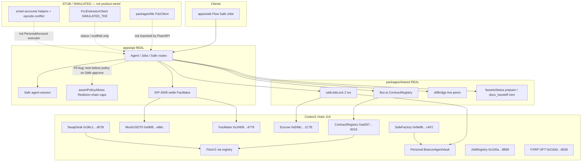
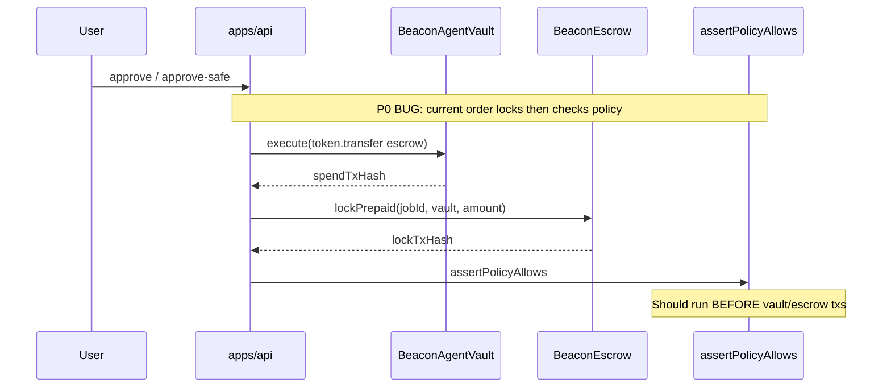
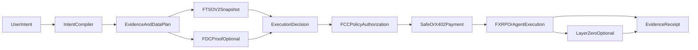
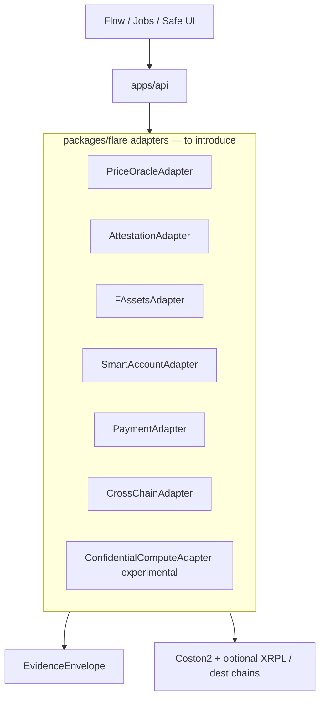
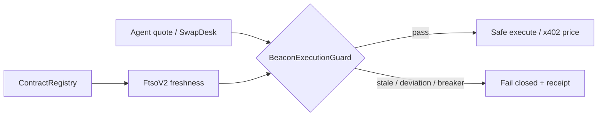
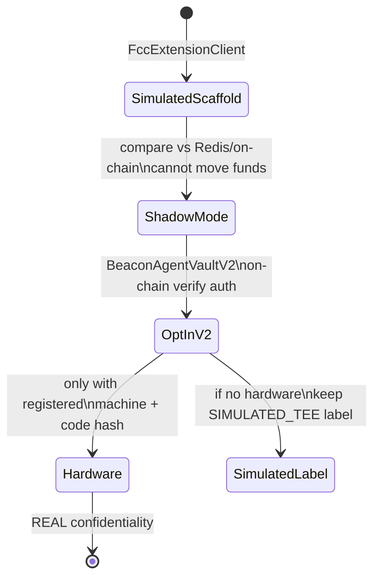
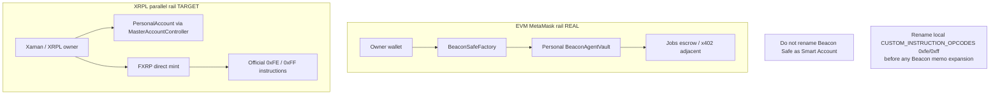
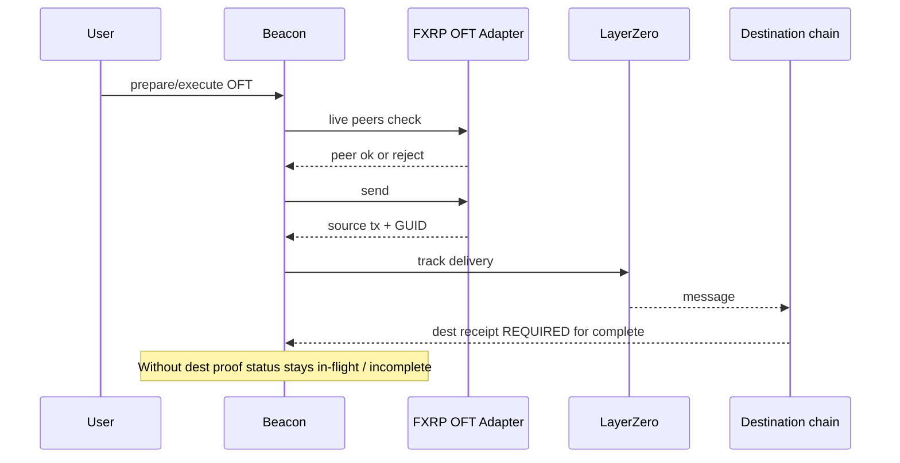

# Flare-Native Beacon Architecture

**Honesty labels:** `REAL` | `SIMULATED` | `STUB` | `NOT AVAILABLE`  
**Companion:** [`FLARE_DEEP_RESEARCH.md`](./FLARE_DEEP_RESEARCH.md) · [`FLARE_INTEGRATION_GAP_MATRIX.md`](./FLARE_INTEGRATION_GAP_MATRIX.md) · [`FLARE_IMPLEMENTATION_PLAN.md`](./FLARE_IMPLEMENTATION_PLAN.md)

---

## 1. Product thesis

Beacon becomes a **Flare-native AI execution OS** by composing:

| Need | Flare / Beacon surface | Honesty today |
| --- | --- | --- |
| Decision data | FTSOv2 via ContractRegistry | REAL reads |
| External evidence | FDC | STUB in Flow/API |
| Confidential policy | FCC / FCE | SIMULATED_TEE |
| Machine payment | x402 EIP-3009 | REAL |
| Agent spend vault | Personal BeaconAgentVault (Safe) | REAL |
| XRP liquidity | FAssets + Smart Accounts | Partial / STUB |
| Cross-chain FXRP | LayerZero OFT | REAL source path |

**Non-goals:** rewrite Flow/Safe/Jobs/AI router; force every primitive into one path; claim hardware TEE or live FDC without proofs.

---

## 2. Current architecture (as deployed / wired)

### 2.1 Current system context

### 2.2 Jobs Safe lock lifecycle (REAL, 2 txs)

**Correct target order:** session → policy (and FCC when enforced) → `vault.execute` → `lockPrepaid` → record spend → receipt.

### 2.3 Trust boundaries today

| Boundary | Who is trusted | Honesty |
| --- | --- | --- |
| Owner wallet | Signs deposits / EIP-3009; owns personal vault | REAL |
| Settler / executor key | Gas relayer for vault.execute + escrow ops | REAL — must not bypass policy |
| Redis / server policy | `assertPolicyAllows` | REAL but currently after Safe lock (bug) |
| On-chain vault caps | maxSpend / allowlists / pause | REAL defense-in-depth |
| FCC | Simulated attestation | SIMULATED — not hardware |
| FDC | Unused in product path | STUB |
| Application receipt | UX record + explorer links | REAL as app record, not FDC proof |

---

## 3. Target architecture

### 3.1 Intent → evidence → authorize → pay → execute → prove

**Honesty rule:** FDC, FCC, FAssets, Smart Accounts, and LayerZero appear in the receipt **only** when their proof is visible in that run. Otherwise omit or label `NOT AVAILABLE` / `STUB` / `SIMULATED`.

### 3.2 Adapter layer (target)

Risky features stay behind **executable** flags: FDC, FCC shadow/enforced, Smart Accounts, FAssets direct mint, cross-chain compose.

### 3.3 EvidenceEnvelope (target schema — conceptual)

Shared envelope fields (implementation later; no invented APIs beyond this doc contract):

| Field | Purpose |
| --- | --- |
| inputCommitment | Hash of user intent / job id / service id |
| quoteOrDataSnapshot | FTSO timestamp + feeds / quote |
| policyDecision | allow/deny, epoch, reason commitment |
| payment | x402 auth or Safe spend+lock hashes |
| execution | Agent / swap / mint result refs |
| externalProof | FDC proof hash / round when used |
| crossChain | OFT GUID + dest receipt when claimed complete |
| receiptLinks | Explorer URLs for **real** hashes only |

---

## 4. Protocol-specific architectures

### 4.1 FTSO execution guard (P0)

**Label today:** FTSO reads REAL; guard module NOT YET product — treat as planned REAL.

### 4.2 FDC evidence engine (P0 when claimed)

Official lifecycle (see https://dev.flare.network/fdc/overview): encode/prepare → `FdcHub.requestAttestation` → voting round → Relay finalization → DA proof → `FdcVerification`.

Beacon target consumers (allowlisted only):

1. `EVMTransaction` — external chain execution evidence  
2. Payment / XRPLPayment — funding / action evidence  
3. Deterministic allowlisted `Web2Json` — event-triggered agents  

Never treat a structurally valid proof as sufficient business authorization without Beacon policy.

**Today:** `STUB` in Flow/API.

### 4.3 FCC confidential authorization (P1)

Official note: FCC **not yet fully public production** — https://dev.flare.network/fcc/overview  

V1 factory Safes are **never** silently migrated.

### 4.4 Dual rails: Beacon Safe vs Smart Accounts (P1)

`MasterAccountController` expected: `0x434936d47503353f06750Db1A444DBDC5F0AD37c`.

### 4.5 LayerZero (P2)

---

## 5. Judge flows (narrow demos)

### Primary — Verifiable Agent Spend

1. Fund personal Safe (MockUSDT0).  
2. FTSO-bound quote / decision.  
3. Optional deterministic FDC trigger **only if verified**.  
4. Policy: server + optional FCC shadow/V2.  
5. Pay: x402 machine service and/or Safe escrow.  
6. Execute agent action.  
7. Evidence receipt opens **real** Coston2 explorer links.

Primary remains valid with FCC labeled `SIMULATED_TEE`.

### Secondary — One XRPL Intent

1. Xaman payment → direct mint FXRP to PersonalAccount.  
2. Allowlisted Smart Account instruction.  
3. Optional LZ bridge **only with dest proof**.  
4. Receipt spans XRPL + FDC/FAssets + Flare (+ dest).

Keep secondary **parallel** to MetaMask Safe; do not force XRPL users into MockUSDT0 Safe path.

---

## 6. Failure modes

| Failure | Behavior |
| --- | --- |
| Policy deny | Zero spend txs; authorization receipt shows deny |
| FTSO stale / breaker | Fail closed for value-moving guarded actions; informational UI may degrade read-only |
| FDC timeout | Job/action shows timed-out; no false “verified” |
| FCC unavailable | No fail-open for enforced mode; V1 policy remains |
| FCC SIMULATED | Explicit honesty badge; no hardware claim |
| LZ no dest proof | Never mark complete |
| Opcode misuse | Block until Beacon locals renamed away from `0xFE`/`0xFF` |
| Mint without XRPL | Remain `docs_handoff` — no fake button |

---

## 7. Security architecture notes

1. **P0:** move `assertPolicyAllows` before `executeSafeJobLock` in both approve routes.  
2. Executor is a gas relayer, not an authorization oracle.  
3. On-chain vault limits remain after FCC lands.  
4. EvidenceEnvelope commitments should make receipts inspectable without inventing hashes.  
5. Feature flags must be executable, not documentation-only.

---

## 8. Honesty summary for architecture slides

| Claim | Label |
| --- | --- |
| Personal Safe + Jobs 2-tx lock + x402 + FTSO reads + OFT with live peers | REAL |
| FCC confidentiality | SIMULATED |
| Flow FDC | STUB |
| Smart Accounts product rail | STUB (helpers; opcode rename required) |
| Hardware TEE / official flare-fcc skill | NOT AVAILABLE |

**Next:** [`FLARE_IMPLEMENTATION_PLAN.md`](./FLARE_IMPLEMENTATION_PLAN.md)
